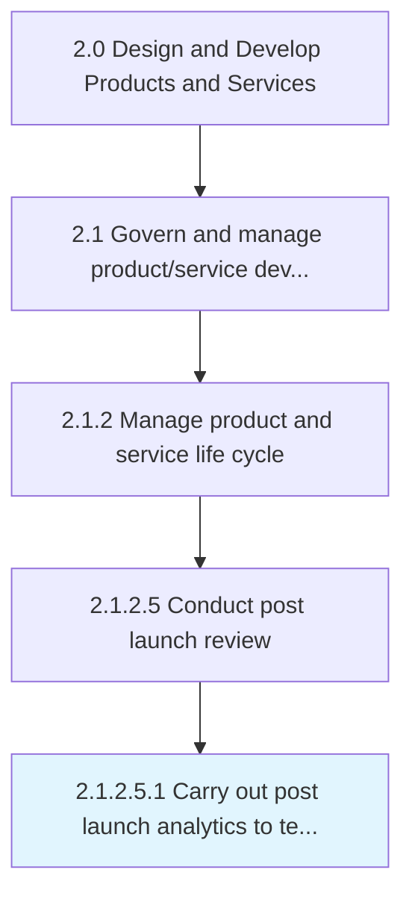
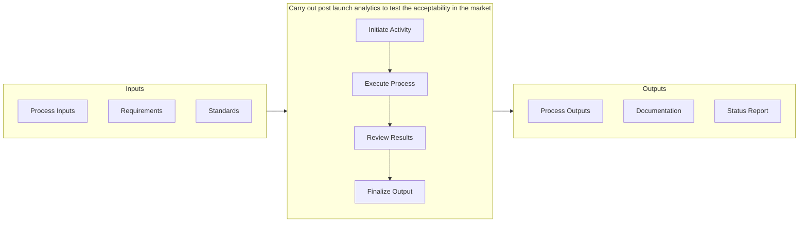

# Carry out post launch analytics to test the acceptability in the market

> Measuring the performance of marketing once the product/services are launched.

## Overview

Sub-Activity 2.1.2.5.1 is an activity within the Design and Develop Products and Services framework. 

Measuring the performance of marketing once the product/services are launched. This broadly covers measuring user engagement and product's/service's performance in the market.

This activity is critical to ensuring that products and services meet established quality benchmarks before advancing through subsequent development stages. It involves systematic evaluation against predefined criteria, cross-functional collaboration to address identified gaps, and documentation of findings to support continuous improvement. The process draws on both quantitative metrics and qualitative assessments from subject matter experts.

## Process Hierarchy



## Key Statistics

| Metric | Value |
|--------|-------|
| APQC Code | 19646 |
| Hierarchy ID | 2.1.2.5.1 |
| Level | Sub-Activity |
| Parent | [2.1.2.5](../) |
| Sub-Processes | 0 |


## GraphDL Semantic Structure

```
carry.OutPostLaunchAnalytics.to.TestTheAcceptabilityInTheMarket
```

| Component | Value | Description |
|-----------|-------|-------------|
| Verb | `carry` | Primary action |
| Object | `out post launch analytics` | Direct object |
| Preposition | `to` | Relationship |
| PrepObject | `test the acceptability in the market` | Indirect object |


## Related Concepts

- PostLaunchAnalyticsToTestAcceptabilityInMarket


## Process Flow



## RACI Matrix

| Activity | Responsible | Accountable | Consulted | Informed |
|----------|-------------|-------------|-----------|----------|
| Define scope and objectives | Product Manager | VP of Product | Engineering Lead | Executive Team |
| Execute and document | Product Analyst | Product Manager | Quality Assurance | Stakeholders |
| Review and approve | Quality Manager | VP of Product | Legal/Compliance | Product Team |

## Related Occupations

- [Product Manager](/occupations/Management/ProductManagers) - Leads portfolio governance and lifecycle management
- [Chief Technology Officer](/occupations/Management/ChiefExecutives) - Provides strategic oversight for product development
- [Quality Assurance Manager](/occupations/Management/QualityControlSystems) - Ensures compliance with quality standards
- [Regulatory Affairs Specialist](/occupations/Legal/RegulatoryAffairs) - Manages patent, copyright, and regulatory compliance

## Related Departments

- [Product Management](/departments/ProductManagement) - Owns product portfolio strategy and governance
- [Quality Assurance](/departments/QualityAssurance) - Maintains quality standards and compliance
- [Legal & Compliance](/departments/Legal) - Manages intellectual property and regulatory requirements

## Industry Variations

### Retail

Market testing focuses on consumer behavior analysis, seasonal demand patterns, and omnichannel launch readiness across physical and digital storefronts.

### Consumer Products

Extensive focus group testing, packaging evaluation, and shelf-placement strategy drive market introduction decisions.

### Technology

Beta programs, early adopter feedback loops, and agile launch iterations with continuous deployment characterize the market introduction approach.

## KPIs & Metrics

| Metric | Description | Target |
|--------|-------------|--------|
| Defect Rate | Percentage of defects identified per review cycle | < 2% |
| Review Cycle Time | Average time to complete review process | < 5 business days |
| First Pass Yield | Percentage of items passing review on first attempt | > 85% |

---

*Source: APQC PCF 19646 (2.1.2.5.1) - APQC*
