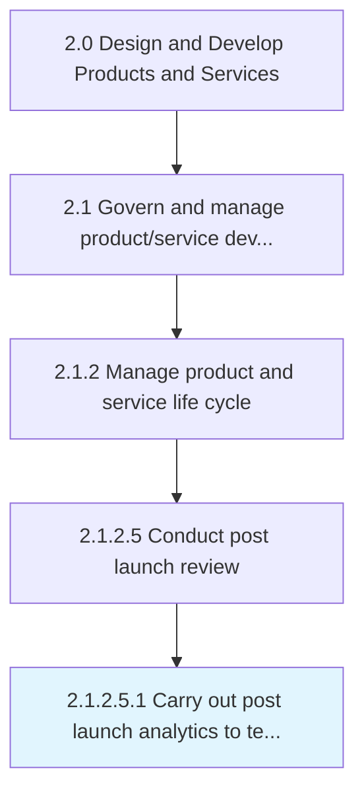

# Carry out post launch analytics to test the acceptability in the market

> Measuring the performance of marketing once the product/services are launched.

## Overview

Sub-Activity 2.1.2.5.1 is an activity within the Design and Develop Products and Services framework. 

Measuring the performance of marketing once the product/services are launched. This broadly covers measuring user engagement and product's/service's performance in the market.

## Process Hierarchy



## Key Statistics

| Metric | Value |
|--------|-------|
| APQC Code | 19646 |
| Hierarchy ID | 2.1.2.5.1 |
| Level | Sub-Activity |
| Parent | [2.1.2.5](../) |
| Sub-Processes | 0 |


## GraphDL Semantic Structure

```
carry.OutPostLaunchAnalytics.to.TestTheAcceptabilityInTheMarket
```

| Component | Value | Description |
|-----------|-------|-------------|
| Verb | `carry` | Primary action |
| Object | `out post launch analytics` | Direct object |
| Preposition | `to` | Relationship |
| PrepObject | `test the acceptability in the market` | Indirect object |


## Related Concepts

- [PostLaunchAnalyticsToTestAcceptabilityInMarket](/concepts/PostLaunchAnalyticsToTestAcceptabilityInMarket)


---

*Source: APQC PCF 19646 (2.1.2.5.1) - APQC*
