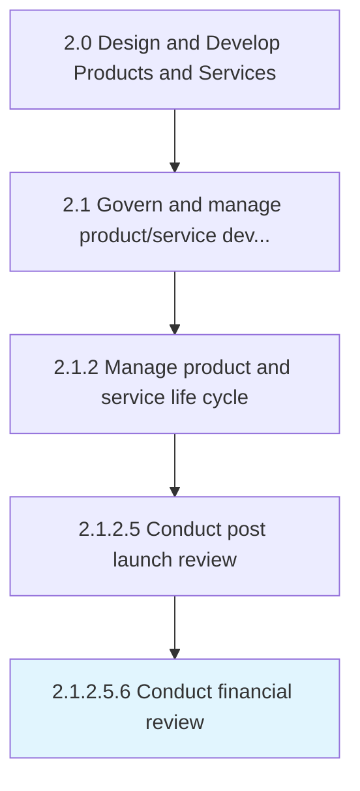
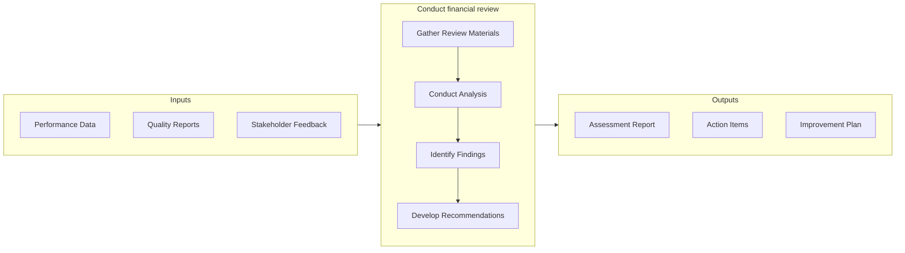

# Conduct financial review

> Evaluating organization's financial reports and financial reporting processes.

## Overview

Sub-Activity 2.1.2.5.6 is an activity within the Design and Develop Products and Services framework. 

Evaluating organization's financial reports and financial reporting processes. Review and document the ROI catered by the product/service delivery to the customer in the market.

This activity ensures financial discipline throughout the product development lifecycle by establishing clear cost parameters and monitoring adherence to budget targets. It requires close coordination between finance, product management, and engineering teams to balance investment levels with projected returns. Effective execution of this process helps organizations optimize resource allocation and maximize the commercial viability of new offerings.

## Process Hierarchy



## Key Statistics

| Metric | Value |
|--------|-------|
| APQC Code | 11427 |
| Hierarchy ID | 2.1.2.5.6 |
| Level | Sub-Activity |
| Parent | [2.1.2.5](../) |
| Sub-Processes | 0 |


## GraphDL Semantic Structure

```
conduct.FinancialReview
```

| Component | Value | Description |
|-----------|-------|-------------|
| Verb | `conduct` | Primary action |
| Object | `financial review` | Direct object |


## Related Concepts

- FinancialReview


## Process Flow



## RACI Matrix

| Activity | Responsible | Accountable | Consulted | Informed |
|----------|-------------|-------------|-----------|----------|
| Define scope and objectives | Product Manager | VP of Product | Engineering Lead | Executive Team |
| Execute and document | Product Analyst | Product Manager | Quality Assurance | Stakeholders |
| Review and approve | Quality Manager | VP of Product | Legal/Compliance | Product Team |

## Related Occupations

- [Product Manager](/occupations/Management/ProductManagers) - Leads portfolio governance and lifecycle management
- [Chief Technology Officer](/occupations/Management/ChiefExecutives) - Provides strategic oversight for product development
- [Quality Assurance Manager](/occupations/Management/QualityControlSystems) - Ensures compliance with quality standards
- [Regulatory Affairs Specialist](/occupations/Legal/RegulatoryAffairs) - Manages patent, copyright, and regulatory compliance

## Related Departments

- [Product Management](/departments/ProductManagement) - Owns product portfolio strategy and governance
- [Quality Assurance](/departments/QualityAssurance) - Maintains quality standards and compliance
- [Legal & Compliance](/departments/Legal) - Manages intellectual property and regulatory requirements

## Industry Variations

### Manufacturing

Cost targets are tightly linked to bill of materials optimization, production line efficiency, and supply chain cost negotiations.

### Life Sciences

Cost planning must account for lengthy R&D cycles, clinical trial expenses, and post-market surveillance investments.

### Retail

Cost and quality targets are driven by competitive pricing pressures, seasonal inventory management, and private label margin requirements.

## KPIs & Metrics

| Metric | Description | Target |
|--------|-------------|--------|
| Defect Rate | Percentage of defects identified per review cycle | < 2% |
| Review Cycle Time | Average time to complete review process | < 5 business days |
| First Pass Yield | Percentage of items passing review on first attempt | > 85% |

---

*Source: APQC PCF 11427 (2.1.2.5.6) - APQC*
