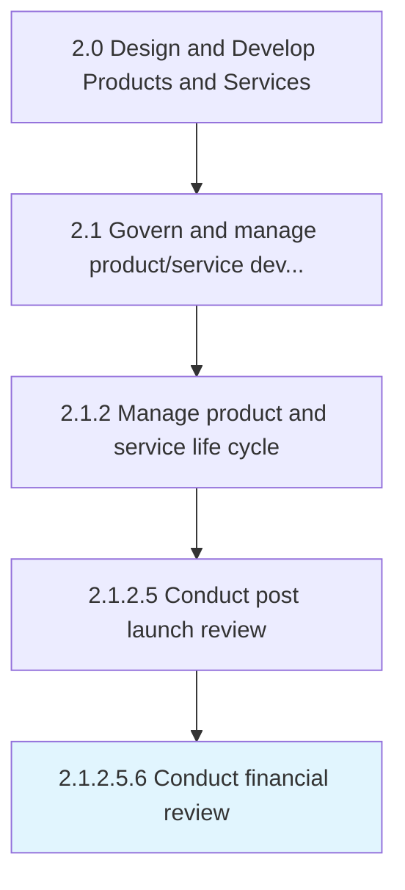

# Conduct financial review

> Evaluating organization's financial reports and financial reporting processes.

## Overview

Sub-Activity 2.1.2.5.6 is an activity within the Design and Develop Products and Services framework. 

Evaluating organization's financial reports and financial reporting processes. Review and document the ROI catered by the product/service delivery to the customer in the market.

## Process Hierarchy



## Key Statistics

| Metric | Value |
|--------|-------|
| APQC Code | 11427 |
| Hierarchy ID | 2.1.2.5.6 |
| Level | Sub-Activity |
| Parent | [2.1.2.5](../) |
| Sub-Processes | 0 |


## GraphDL Semantic Structure

```
conduct.FinancialReview
```

| Component | Value | Description |
|-----------|-------|-------------|
| Verb | `conduct` | Primary action |
| Object | `financial review` | Direct object |


## Related Concepts

- [FinancialReview](/concepts/FinancialReview)


---

*Source: APQC PCF 11427 (2.1.2.5.6) - APQC*
