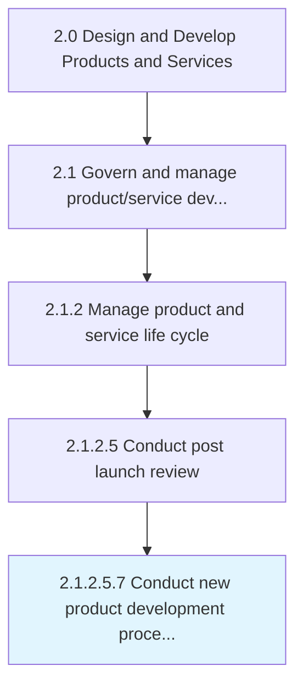

# Conduct new product development process assessment

> Analyzing the steps involved in the development of new product, its effect on existing product, resources, and functions related to the development of the new product until its sale in the competitive market place.

## Overview

Sub-Activity 2.1.2.5.7 is an activity within the Design and Develop Products and Services framework. 

Analyzing the steps involved in the development of new product, its effect on existing product, resources, and functions related to the development of the new product until its sale in the competitive market place.

## Process Hierarchy



## Key Statistics

| Metric | Value |
|--------|-------|
| APQC Code | 11428 |
| Hierarchy ID | 2.1.2.5.7 |
| Level | Sub-Activity |
| Parent | [2.1.2.5](../) |
| Sub-Processes | 0 |


## GraphDL Semantic Structure

```
conduct.NewProductDevelopmentProcessAssessment
```

| Component | Value | Description |
|-----------|-------|-------------|
| Verb | `conduct` | Primary action |
| Object | `new product development process assessment` | Direct object |


## Related Concepts

- [NewProductDevelopmentProcessAssessment](/concepts/NewProductDevelopmentProcessAssessment)


---

*Source: APQC PCF 11428 (2.1.2.5.7) - APQC*
