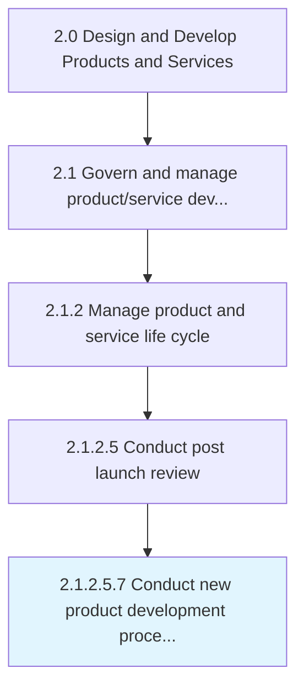
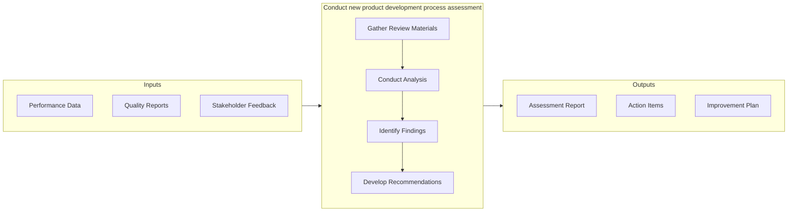

# Conduct new product development process assessment

> Analyzing the steps involved in the development of new product, its effect on existing product, resources, and functions related to the development of the new product until its sale in the competitive market place.

## Overview

Sub-Activity 2.1.2.5.7 is an activity within the Design and Develop Products and Services framework. 

Analyzing the steps involved in the development of new product, its effect on existing product, resources, and functions related to the development of the new product until its sale in the competitive market place.

This activity contributes to the organization's product development objectives by executing defined processes within established quality and timeline parameters. It requires coordination across relevant functional teams and adherence to organizational standards. Outputs from this activity feed into downstream processes and contribute to overall product development success.

## Process Hierarchy



## Key Statistics

| Metric | Value |
|--------|-------|
| APQC Code | 11428 |
| Hierarchy ID | 2.1.2.5.7 |
| Level | Sub-Activity |
| Parent | [2.1.2.5](../) |
| Sub-Processes | 0 |


## GraphDL Semantic Structure

```
conduct.NewProductDevelopmentProcessAssessment
```

| Component | Value | Description |
|-----------|-------|-------------|
| Verb | `conduct` | Primary action |
| Object | `new product development process assessment` | Direct object |


## Related Concepts

- NewProductDevelopmentProcessAssessment


## Process Flow



## RACI Matrix

| Activity | Responsible | Accountable | Consulted | Informed |
|----------|-------------|-------------|-----------|----------|
| Define scope and objectives | Product Manager | VP of Product | Engineering Lead | Executive Team |
| Execute and document | Product Analyst | Product Manager | Quality Assurance | Stakeholders |
| Review and approve | Quality Manager | VP of Product | Legal/Compliance | Product Team |

## Related Occupations

- [Product Manager](/occupations/Management/ProductManagers) - Leads portfolio governance and lifecycle management
- [Chief Technology Officer](/occupations/Management/ChiefExecutives) - Provides strategic oversight for product development
- [Quality Assurance Manager](/occupations/Management/QualityControlSystems) - Ensures compliance with quality standards
- [Regulatory Affairs Specialist](/occupations/Legal/RegulatoryAffairs) - Manages patent, copyright, and regulatory compliance

## Related Departments

- [Product Management](/departments/ProductManagement) - Owns product portfolio strategy and governance
- [Quality Assurance](/departments/QualityAssurance) - Maintains quality standards and compliance
- [Legal & Compliance](/departments/Legal) - Manages intellectual property and regulatory requirements

## Industry Variations

### Manufacturing

Emphasizes physical product specifications, tooling requirements, and lean production principles in process execution.

### Technology

Focuses on agile development methodologies, continuous integration, and rapid iteration cycles with digital-first delivery.

### Healthcare

Requires adherence to patient safety standards, clinical efficacy validation, and comprehensive regulatory documentation.

## KPIs & Metrics

| Metric | Description | Target |
|--------|-------------|--------|
| Time to Prototype | Duration from concept approval to working prototype | < 30 days |
| Design Iteration Count | Number of design revisions before approval | < 3 iterations |
| Specification Compliance | Percentage of design specs met by prototype | > 95% |

---

*Source: APQC PCF 11428 (2.1.2.5.7) - APQC*
