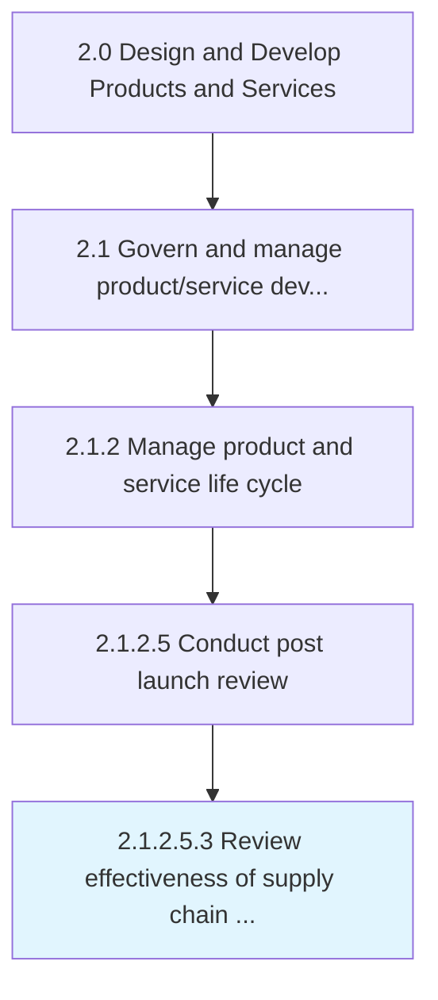

# Review effectiveness of supply chain and distribution network

> Determining the performance of supply chain to all departments and logistics from input to shop floor.

## Overview

Sub-Activity 2.1.2.5.3 is an activity within the Design and Develop Products and Services framework. 

Determining the performance of supply chain to all departments and logistics from input to shop floor. Seeking performance reviews at each intersection and communication channels. Review effectiveness of supply chain and distribution to check if it is meeting the demands of the various groups and organizations that are concerned with its activities (groups might include customers, partners, suppliers, and vendors).

## Process Hierarchy



## Key Statistics

| Metric | Value |
|--------|-------|
| APQC Code | 11425 |
| Hierarchy ID | 2.1.2.5.3 |
| Level | Sub-Activity |
| Parent | [2.1.2.5](../) |
| Sub-Processes | 0 |


## GraphDL Semantic Structure

```
review.Effectiveness.of.SupplyChainAndDistributionNetwork
```

| Component | Value | Description |
|-----------|-------|-------------|
| Verb | `review` | Primary action |
| Object | `effectiveness` | Direct object |
| Preposition | `of` | Relationship |
| PrepObject | `supply chain and distribution network` | Indirect object |


## Related Concepts

- Effectiveness
- SupplyChainNetwork
- Effectiveness
- DistributionNetwork


---

*Source: APQC PCF 11425 (2.1.2.5.3) - APQC*
