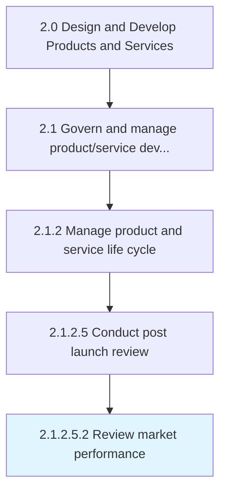
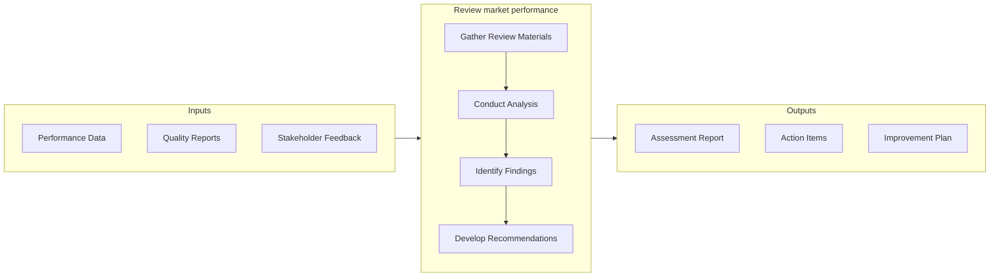

# Review market performance

> Conducting customer and market analysis to review progress and identify opportunities for increasing market position.

## Overview

Sub-Activity 2.1.2.5.2 is an activity within the Design and Develop Products and Services framework. 

Conducting customer and market analysis to review progress and identify opportunities for increasing market position. Track and review product/service response through sales reports, website statistics, direct response from customers, and survey reports.

This activity bridges the gap between product development and commercial availability by validating market readiness and executing go-to-market strategies. It requires coordination across product, marketing, sales, and operations teams to ensure a successful introduction. Key considerations include competitive positioning, channel readiness, and customer communication planning.

## Process Hierarchy



## Key Statistics

| Metric | Value |
|--------|-------|
| APQC Code | 11424 |
| Hierarchy ID | 2.1.2.5.2 |
| Level | Sub-Activity |
| Parent | [2.1.2.5](../) |
| Sub-Processes | 0 |


## GraphDL Semantic Structure

```graphdl
review.MarketPerformance
```

| Component | Value | Description |
|-----------|-------|-------------|
| Verb | `review` | Primary action |
| Object | `market performance` | Direct object |


## Related Concepts

- MarketPerformance


## Process Flow



## RACI Matrix

| Activity | Responsible | Accountable | Consulted | Informed |
|----------|-------------|-------------|-----------|----------|
| Define scope and objectives | Product Manager | VP of Product | Engineering Lead | Executive Team |
| Execute and document | Product Analyst | Product Manager | Quality Assurance | Stakeholders |
| Review and approve | Quality Manager | VP of Product | Legal/Compliance | Product Team |

## Related Occupations

- [Product Manager](/occupations/Management/ProductManagers) - Leads portfolio governance and lifecycle management
- [Chief Technology Officer](/occupations/Management/ChiefExecutives) - Provides strategic oversight for product development
- [Quality Assurance Manager](/occupations/Management/QualityControlSystems) - Ensures compliance with quality standards
- [Regulatory Affairs Specialist](/occupations/Legal/RegulatoryAffairs) - Manages patent, copyright, and regulatory compliance

## Related Departments

- Product Management - Owns product portfolio strategy and governance
- Quality Assurance - Maintains quality standards and compliance
- [Legal & Compliance](/departments/Legal) - Manages intellectual property and regulatory requirements

## Industry Variations

### Retail

Market testing focuses on consumer behavior analysis, seasonal demand patterns, and omnichannel launch readiness across physical and digital storefronts.

### Consumer Products

Extensive focus group testing, packaging evaluation, and shelf-placement strategy drive market introduction decisions.

### Technology

Beta programs, early adopter feedback loops, and agile launch iterations with continuous deployment characterize the market introduction approach.

## KPIs & Metrics

| Metric | Description | Target |
|--------|-------------|--------|
| Defect Rate | Percentage of defects identified per review cycle | < 2% |
| Review Cycle Time | Average time to complete review process | < 5 business days |
| First Pass Yield | Percentage of items passing review on first attempt | > 85% |

---

*Source: APQC PCF 11424 (2.1.2.5.2) - APQC*
