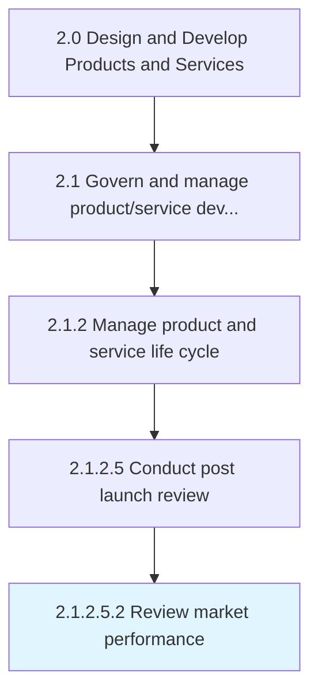

# Review market performance

> Conducting customer and market analysis to review progress and identify opportunities for increasing market position.

## Overview

Sub-Activity 2.1.2.5.2 is an activity within the Design and Develop Products and Services framework. 

Conducting customer and market analysis to review progress and identify opportunities for increasing market position. Track and review product/service response through sales reports, website statistics, direct response from customers, and survey reports.

## Process Hierarchy



## Key Statistics

| Metric | Value |
|--------|-------|
| APQC Code | 11424 |
| Hierarchy ID | 2.1.2.5.2 |
| Level | Sub-Activity |
| Parent | [2.1.2.5](../) |
| Sub-Processes | 0 |


## GraphDL Semantic Structure

```
review.MarketPerformance
```

| Component | Value | Description |
|-----------|-------|-------------|
| Verb | `review` | Primary action |
| Object | `market performance` | Direct object |


## Related Concepts

- [MarketPerformance](/concepts/MarketPerformance)


---

*Source: APQC PCF 11424 (2.1.2.5.2) - APQC*
