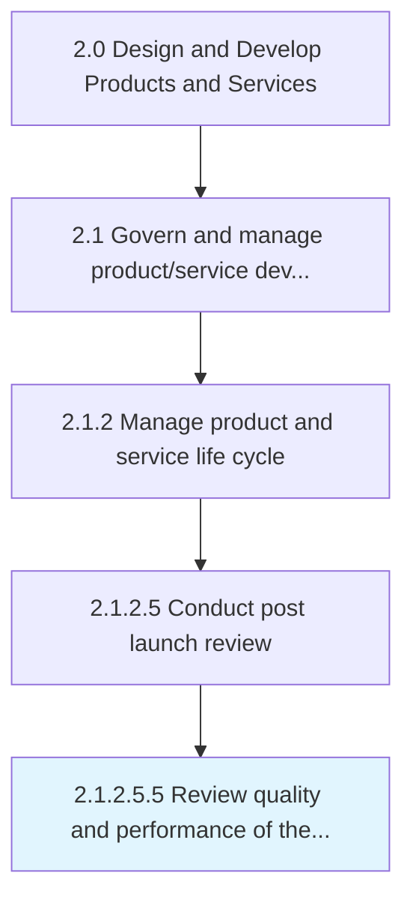
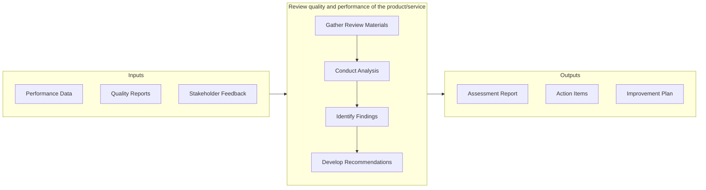

# Review quality and performance of the product/service

> Identifying the quality and performance of the product/service delivered to customers.

## Overview

Sub-Activity 2.1.2.5.5 is an activity within the Design and Develop Products and Services framework. 

Identifying the quality and performance of the product/service delivered to customers. Analyze data from the customer feedback, audits, measures of customer satisfaction (such as product quality complaints and recalls), and organizational policies on delivery.

This activity is critical to ensuring that products and services meet established quality benchmarks before advancing through subsequent development stages. It involves systematic evaluation against predefined criteria, cross-functional collaboration to address identified gaps, and documentation of findings to support continuous improvement. The process draws on both quantitative metrics and qualitative assessments from subject matter experts.

## Process Hierarchy



## Key Statistics

| Metric | Value |
|--------|-------|
| APQC Code | 11426 |
| Hierarchy ID | 2.1.2.5.5 |
| Level | Sub-Activity |
| Parent | [2.1.2.5](../) |
| Sub-Processes | 0 |


## GraphDL Semantic Structure

```graphdl
review.QualityAndPerformance.of.TheProductservice
```

| Component | Value | Description |
|-----------|-------|-------------|
| Verb | `review` | Primary action |
| Object | `quality and performance` | Direct object |
| Preposition | `of` | Relationship |
| PrepObject | `the product/service` | Indirect object |


## Related Concepts

- Quality
- Product
- Quality
- Service
- Performance
- Product
- Performance
- Service


## Process Flow



## RACI Matrix

| Activity | Responsible | Accountable | Consulted | Informed |
|----------|-------------|-------------|-----------|----------|
| Define scope and objectives | Product Manager | VP of Product | Engineering Lead | Executive Team |
| Execute and document | Product Analyst | Product Manager | Quality Assurance | Stakeholders |
| Review and approve | Quality Manager | VP of Product | Legal/Compliance | Product Team |

## Related Occupations

- [Product Manager](/occupations/Management/ProductManagers) - Leads portfolio governance and lifecycle management
- [Chief Technology Officer](/occupations/Management/ChiefExecutives) - Provides strategic oversight for product development
- [Quality Assurance Manager](/occupations/Management/QualityControlSystems) - Ensures compliance with quality standards
- [Regulatory Affairs Specialist](/occupations/Legal/RegulatoryAffairs) - Manages patent, copyright, and regulatory compliance

## Related Departments

- Product Management - Owns product portfolio strategy and governance
- Quality Assurance - Maintains quality standards and compliance
- [Legal & Compliance](/departments/Legal) - Manages intellectual property and regulatory requirements

## Industry Variations

### Manufacturing

Emphasizes physical product specifications, tooling requirements, and lean production principles in process execution.

### Technology

Focuses on agile development methodologies, continuous integration, and rapid iteration cycles with digital-first delivery.

### Healthcare

Requires adherence to patient safety standards, clinical efficacy validation, and comprehensive regulatory documentation.

## KPIs & Metrics

| Metric | Description | Target |
|--------|-------------|--------|
| Defect Rate | Percentage of defects identified per review cycle | < 2% |
| Review Cycle Time | Average time to complete review process | < 5 business days |
| First Pass Yield | Percentage of items passing review on first attempt | > 85% |

---

*Source: APQC PCF 11426 (2.1.2.5.5) - APQC*
