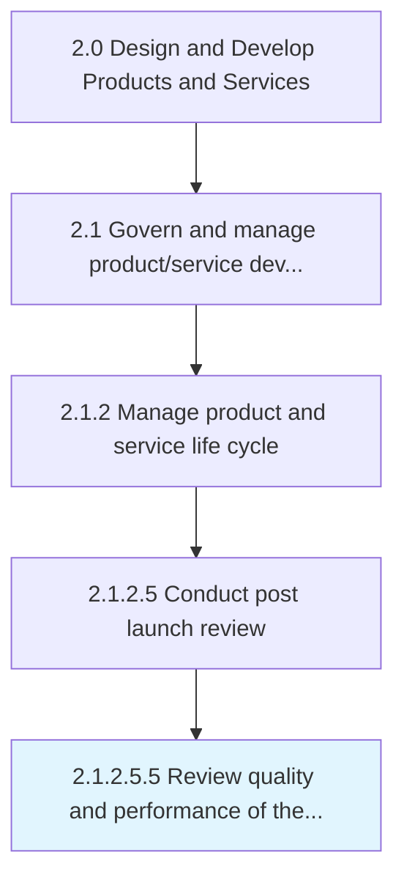

# Review quality and performance of the product/service

> Identifying the quality and performance of the product/service delivered to customers.

## Overview

Sub-Activity 2.1.2.5.5 is an activity within the Design and Develop Products and Services framework. 

Identifying the quality and performance of the product/service delivered to customers. Analyze data from the customer feedback, audits, measures of customer satisfaction (such as product quality complaints and recalls), and organizational policies on delivery.

## Process Hierarchy



## Key Statistics

| Metric | Value |
|--------|-------|
| APQC Code | 11426 |
| Hierarchy ID | 2.1.2.5.5 |
| Level | Sub-Activity |
| Parent | [2.1.2.5](../) |
| Sub-Processes | 0 |


## GraphDL Semantic Structure

```
review.QualityAndPerformance.of.TheProductservice
```

| Component | Value | Description |
|-----------|-------|-------------|
| Verb | `review` | Primary action |
| Object | `quality and performance` | Direct object |
| Preposition | `of` | Relationship |
| PrepObject | `the product/service` | Indirect object |


## Related Concepts

- Quality
- Product
- Quality
- Service
- Performance
- Product
- Performance
- Service


---

*Source: APQC PCF 11426 (2.1.2.5.5) - APQC*
