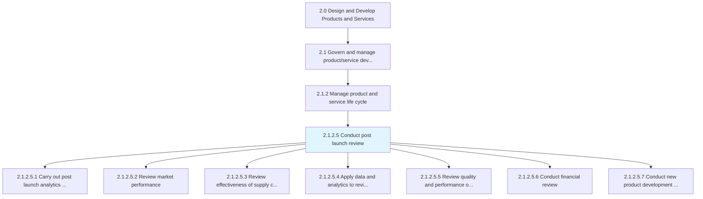
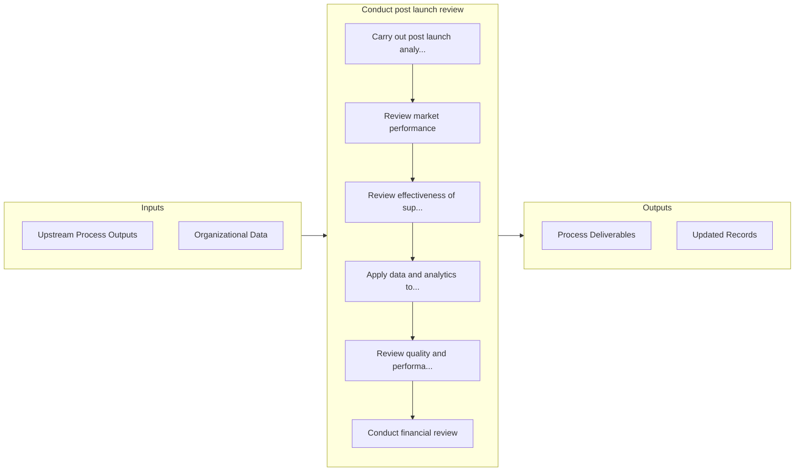

# Conduct post launch review

> Learning from either a test or a full production run within the consumer market.

## Overview

Activity 2.1.2.5 is an activity within the Design and Develop Products and Services framework. 

Learning from either a test or a full production run within the consumer market. Companies use this as an opportunity to both test and react to new products, ideas, or innovations based on the initial reaction of consumers on an individual level. Within this process, analytics are used to determine the relative success of a new product offering. Within this process, companies will launch key analytics to test a products acceptance. They will also review market performance and compare to similar products and against the business case or the financial plan. Companies can also measure the effectiveness of their supply chain network, and can apply what is learned from the post launch review to other new products, processes, and procedures to ensure and enhance the product quality.

## Process Hierarchy



## Key Statistics

| Metric | Value |
|--------|-------|
| APQC Code | 11423 |
| Hierarchy ID | 2.1.2.5 |
| Level | Activity |
| Parent | [2.1.2](../) |
| Sub-Processes | 7 |


## GraphDL Semantic Structure

```
conduct.PostLaunchReview
```

| Component | Value | Description |
|-----------|-------|-------------|
| Verb | `conduct` | Primary action |
| Object | `post launch review` | Direct object |


## Process Flow



## Sub-Processes

| Process | Hierarchy ID | Description |
|---------|-------------|-------------|
| [Carry out post launch analytics to test the acceptability in the market](./CarryOutPostLaunchAnalyticsToTestTheAcceptabilityInTheMarket) | 2.1.2.5.1 | Measuring the performance of marketing once the product/services are launched |
| [Review market performance](./ReviewMarketPerformance) | 2.1.2.5.2 | Conducting customer and market analysis to review progress and identify opportunities for increasing |
| [Review effectiveness of supply chain and distribution network](./ReviewEffectivenessOfSupplyChainAndDistributionNetwork) | 2.1.2.5.3 | Determining the performance of supply chain to all departments and logistics from input to shop floo |
| [Apply data and analytics to review supply chain methodologies](./ApplyDataAndAnalyticsToReviewSupplyChainMethodologies) | 2.1.2.5.4 | Collecting and examining raw data with the purpose of drawing conclusions about that information and |
| [Review quality and performance of the product/service](./ReviewQualityAndPerformanceOfTheProductservice) | 2.1.2.5.5 | Identifying the quality and performance of the product/service delivered to customers |
| [Conduct financial review](./ConductFinancialReview) | 2.1.2.5.6 | Evaluating organization's financial reports and financial reporting processes |
| [Conduct new product development process assessment](./ConductNewProductDevelopmentProcessAssessment) | 2.1.2.5.7 | Analyzing the steps involved in the development of new product, its effect on existing product, reso |


## Related Concepts

- [PostLaunchReview](/concepts/PostLaunchReview)


---

*Source: APQC PCF 11423 (2.1.2.5) - APQC*
