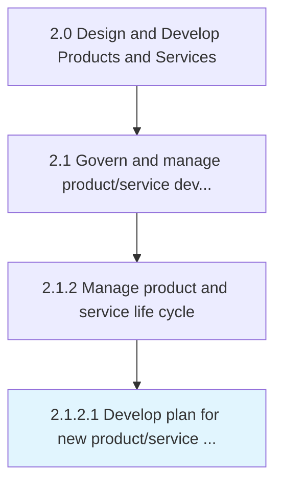
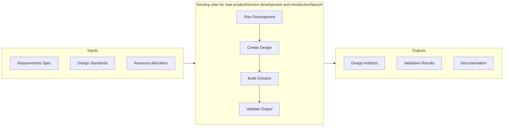

# Develop plan for new product/service development and introduction/launch

> Developing a program and managing a perspective for new product/service introduction and launch.

## Overview

Activity 2.1.2.1 is an activity within the Design and Develop Products and Services framework. 

Developing a program and managing a perspective for new product/service introduction and launch.

This activity bridges the gap between product development and commercial availability by validating market readiness and executing go-to-market strategies. It requires coordination across product, marketing, sales, and operations teams to ensure a successful introduction. Key considerations include competitive positioning, channel readiness, and customer communication planning.

## Process Hierarchy



## Key Statistics

| Metric | Value |
|--------|-------|
| APQC Code | 16824 |
| Hierarchy ID | 2.1.2.1 |
| Level | Activity |
| Parent | [2.1.2](../) |
| Sub-Processes | 0 |


## GraphDL Semantic Structure

```
develop.Plan.for.NewProductserviceDevelopmentAndIntroductionlaunch
```

| Component | Value | Description |
|-----------|-------|-------------|
| Verb | `develop` | Primary action |
| Object | `plan` | Direct object |
| Preposition | `for` | Relationship |
| PrepObject | `new product/service development and introduction/launch` | Indirect object |


## Related Concepts

- Plan
- NewProductDevelopment
- Plan
- NewServiceDevelopment
- Plan
- Introduction
- Plan
- Launch


## Process Flow



## RACI Matrix

| Activity | Responsible | Accountable | Consulted | Informed |
|----------|-------------|-------------|-----------|----------|
| Define scope and objectives | Product Manager | VP of Product | Engineering Lead | Executive Team |
| Execute and document | Product Analyst | Product Manager | Quality Assurance | Stakeholders |
| Review and approve | Quality Manager | VP of Product | Legal/Compliance | Product Team |

## Related Occupations

- [Product Manager](/occupations/Management/ProductManagers) - Leads portfolio governance and lifecycle management
- [Chief Technology Officer](/occupations/Management/ChiefExecutives) - Provides strategic oversight for product development
- [Quality Assurance Manager](/occupations/Management/QualityControlSystems) - Ensures compliance with quality standards
- [Regulatory Affairs Specialist](/occupations/Legal/RegulatoryAffairs) - Manages patent, copyright, and regulatory compliance

## Related Departments

- [Product Management](/departments/ProductManagement) - Owns product portfolio strategy and governance
- [Quality Assurance](/departments/QualityAssurance) - Maintains quality standards and compliance
- [Legal & Compliance](/departments/Legal) - Manages intellectual property and regulatory requirements

## Industry Variations

### Retail

Market testing focuses on consumer behavior analysis, seasonal demand patterns, and omnichannel launch readiness across physical and digital storefronts.

### Consumer Products

Extensive focus group testing, packaging evaluation, and shelf-placement strategy drive market introduction decisions.

### Technology

Beta programs, early adopter feedback loops, and agile launch iterations with continuous deployment characterize the market introduction approach.

## KPIs & Metrics

| Metric | Description | Target |
|--------|-------------|--------|
| Time to Prototype | Duration from concept approval to working prototype | < 30 days |
| Design Iteration Count | Number of design revisions before approval | < 3 iterations |
| Specification Compliance | Percentage of design specs met by prototype | > 95% |

---

*Source: APQC PCF 16824 (2.1.2.1) - APQC*
