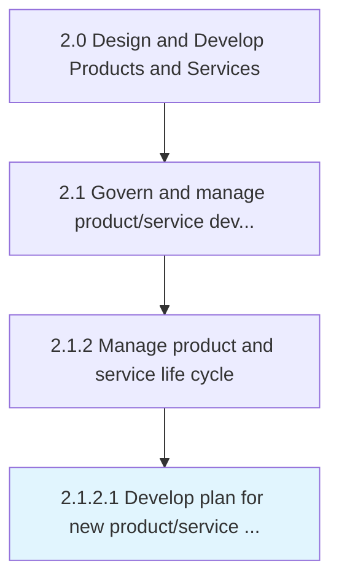

# Develop plan for new product/service development and introduction/launch

> Developing a program and managing a perspective for new product/service introduction and launch.

## Overview

Activity 2.1.2.1 is an activity within the Design and Develop Products and Services framework. 

Developing a program and managing a perspective for new product/service introduction and launch.

## Process Hierarchy



## Key Statistics

| Metric | Value |
|--------|-------|
| APQC Code | 16824 |
| Hierarchy ID | 2.1.2.1 |
| Level | Activity |
| Parent | [2.1.2](../) |
| Sub-Processes | 0 |


## GraphDL Semantic Structure

```
develop.Plan.for.NewProductserviceDevelopmentAndIntroductionlaunch
```

| Component | Value | Description |
|-----------|-------|-------------|
| Verb | `develop` | Primary action |
| Object | `plan` | Direct object |
| Preposition | `for` | Relationship |
| PrepObject | `new product/service development and introduction/launch` | Indirect object |


## Related Concepts

- [Plan](/concepts/Plan)
- [NewProductDevelopment](/concepts/NewProductDevelopment)
- [Plan](/concepts/Plan)
- [NewServiceDevelopment](/concepts/NewServiceDevelopment)
- [Plan](/concepts/Plan)
- [Introduction](/concepts/Introduction)
- [Plan](/concepts/Plan)
- [Launch](/concepts/Launch)


---

*Source: APQC PCF 16824 (2.1.2.1) - APQC*
