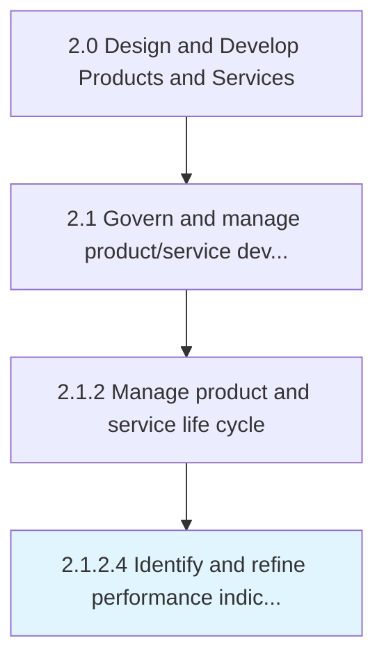

# Identify and refine performance indicators

> Attuning the performance measures of products/services to better reflect the revamped portfolio of solution offerings.

## Overview

Activity 2.1.2.4 is an activity within the Design and Develop Products and Services framework. 

Attuning the performance measures of products/services to better reflect the revamped portfolio of solution offerings. Revise the parameters used to measure performance, apropos the organization's product/service offerings. (Modify these standards in consideration of the changes made to the portfolio by Introduce new products/services [10077] and Retire outdated products/services [10078].)

## Process Hierarchy



## Key Statistics

| Metric | Value |
|--------|-------|
| APQC Code | 10079 |
| Hierarchy ID | 2.1.2.4 |
| Level | Activity |
| Parent | [2.1.2](../) |
| Sub-Processes | 0 |


## GraphDL Semantic Structure

```
identify.AndRefinePerformanceIndicators
```

| Component | Value | Description |
|-----------|-------|-------------|
| Verb | `identify` | Primary action |
| Object | `and refine performance indicators` | Direct object |


## Related Concepts

- PerformanceIndicators
- PerformanceIndicators


---

*Source: APQC PCF 10079 (2.1.2.4) - APQC*
