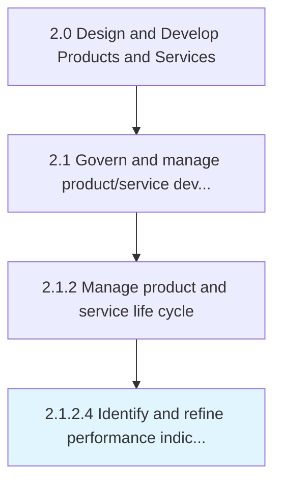
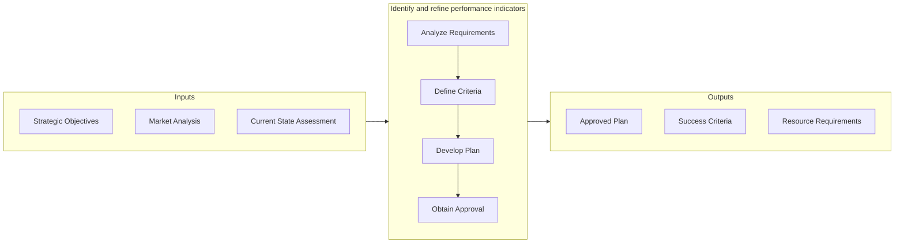

# Identify and refine performance indicators

> Attuning the performance measures of products/services to better reflect the revamped portfolio of solution offerings.

## Overview

Activity 2.1.2.4 is an activity within the Design and Develop Products and Services framework. 

Attuning the performance measures of products/services to better reflect the revamped portfolio of solution offerings. Revise the parameters used to measure performance, apropos the organization's product/service offerings. (Modify these standards in consideration of the changes made to the portfolio by Introduce new products/services [10077] and Retire outdated products/services [10078].)

This activity establishes the analytical foundation for informed decision-making by systematically collecting and evaluating relevant data from multiple sources. It involves structured methodologies for information gathering, stakeholder consultation, and synthesis of findings into actionable insights. The quality of outputs from this process directly impacts the effectiveness of downstream development activities.

## Process Hierarchy



## Key Statistics

| Metric | Value |
|--------|-------|
| APQC Code | 10079 |
| Hierarchy ID | 2.1.2.4 |
| Level | Activity |
| Parent | [2.1.2](../) |
| Sub-Processes | 0 |


## GraphDL Semantic Structure

```graphdl
identify.AndRefinePerformanceIndicators
```

| Component | Value | Description |
|-----------|-------|-------------|
| Verb | `identify` | Primary action |
| Object | `and refine performance indicators` | Direct object |


## Related Concepts

- PerformanceIndicators
- PerformanceIndicators


## Process Flow



## RACI Matrix

| Activity | Responsible | Accountable | Consulted | Informed |
|----------|-------------|-------------|-----------|----------|
| Define scope and objectives | Product Manager | VP of Product | Engineering Lead | Executive Team |
| Execute and document | Product Analyst | Product Manager | Quality Assurance | Stakeholders |
| Review and approve | Quality Manager | VP of Product | Legal/Compliance | Product Team |

## Related Occupations

- [Product Manager](/occupations/Management/ProductManagers) - Leads portfolio governance and lifecycle management
- [Chief Technology Officer](/occupations/Management/ChiefExecutives) - Provides strategic oversight for product development
- [Quality Assurance Manager](/occupations/Management/QualityControlSystems) - Ensures compliance with quality standards
- [Regulatory Affairs Specialist](/occupations/Legal/RegulatoryAffairs) - Manages patent, copyright, and regulatory compliance

## Related Departments

- Product Management - Owns product portfolio strategy and governance
- Quality Assurance - Maintains quality standards and compliance
- [Legal & Compliance](/departments/Legal) - Manages intellectual property and regulatory requirements

## Industry Variations

### Manufacturing

Emphasizes physical product specifications, tooling requirements, and lean production principles in process execution.

### Technology

Focuses on agile development methodologies, continuous integration, and rapid iteration cycles with digital-first delivery.

### Healthcare

Requires adherence to patient safety standards, clinical efficacy validation, and comprehensive regulatory documentation.

## KPIs & Metrics

| Metric | Description | Target |
|--------|-------------|--------|
| Process Cycle Time | Average duration to complete this activity | < 10 business days |
| Completion Rate | Percentage of activities completed on schedule | > 90% |
| Stakeholder Satisfaction | Internal satisfaction score for process outputs | > 4.0/5.0 |

---

*Source: APQC PCF 10079 (2.1.2.4) - APQC*
