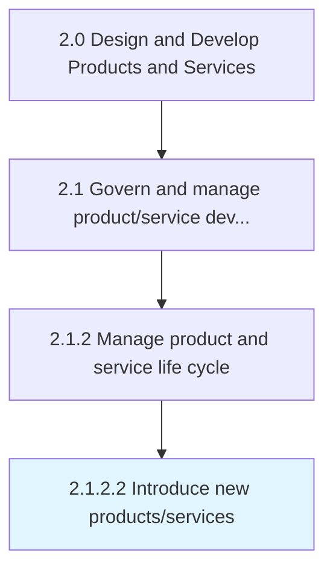

# Introduce new products/services

> Launching revamped product/service portfolio in to the market.

## Overview

Activity 2.1.2.2 is an activity within the Design and Develop Products and Services framework. 

Launching revamped product/service portfolio in to the market. Introduction in to the marketplace is done by deploying effective channels for marketing, sales, delivery, and after-sales servicing. Introduce new/revised solution offerings in a concerted effort. Coordinate a cross-functional effort.

## Process Hierarchy



## Key Statistics

| Metric | Value |
|--------|-------|
| APQC Code | 10077 |
| Hierarchy ID | 2.1.2.2 |
| Level | Activity |
| Parent | [2.1.2](../) |
| Sub-Processes | 0 |


## GraphDL Semantic Structure

```
introduce.NewProductsservices
```

| Component | Value | Description |
|-----------|-------|-------------|
| Verb | `introduce` | Primary action |
| Object | `new products/services` | Direct object |


## Related Concepts

- [NewProducts](/concepts/NewProducts)
- [NewServices](/concepts/NewServices)


---

*Source: APQC PCF 10077 (2.1.2.2) - APQC*
