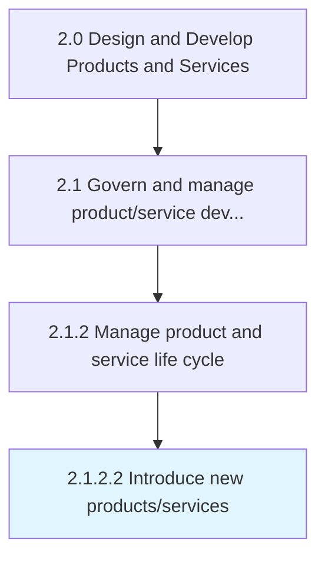
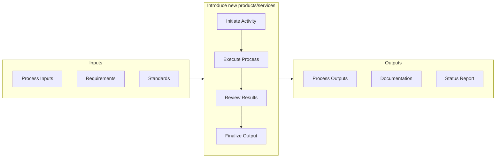

# Introduce new products/services

> Launching revamped product/service portfolio in to the market.

## Overview

Activity 2.1.2.2 is an activity within the Design and Develop Products and Services framework. 

Launching revamped product/service portfolio in to the market. Introduction in to the marketplace is done by deploying effective channels for marketing, sales, delivery, and after-sales servicing. Introduce new/revised solution offerings in a concerted effort. Coordinate a cross-functional effort.

This activity bridges the gap between product development and commercial availability by validating market readiness and executing go-to-market strategies. It requires coordination across product, marketing, sales, and operations teams to ensure a successful introduction. Key considerations include competitive positioning, channel readiness, and customer communication planning.

## Process Hierarchy



## Key Statistics

| Metric | Value |
|--------|-------|
| APQC Code | 10077 |
| Hierarchy ID | 2.1.2.2 |
| Level | Activity |
| Parent | [2.1.2](../) |
| Sub-Processes | 0 |


## GraphDL Semantic Structure

```graphdl
introduce.NewProductsservices
```

| Component | Value | Description |
|-----------|-------|-------------|
| Verb | `introduce` | Primary action |
| Object | `new products/services` | Direct object |


## Related Concepts

- NewProducts
- NewServices


## Process Flow



## RACI Matrix

| Activity | Responsible | Accountable | Consulted | Informed |
|----------|-------------|-------------|-----------|----------|
| Define scope and objectives | Product Manager | VP of Product | Engineering Lead | Executive Team |
| Execute and document | Product Analyst | Product Manager | Quality Assurance | Stakeholders |
| Review and approve | Quality Manager | VP of Product | Legal/Compliance | Product Team |

## Related Occupations

- [Product Manager](/occupations/Management/ProductManagers) - Leads portfolio governance and lifecycle management
- [Chief Technology Officer](/occupations/Management/ChiefExecutives) - Provides strategic oversight for product development
- [Quality Assurance Manager](/occupations/Management/QualityControlSystems) - Ensures compliance with quality standards
- [Regulatory Affairs Specialist](/occupations/Legal/RegulatoryAffairs) - Manages patent, copyright, and regulatory compliance

## Related Departments

- Product Management - Owns product portfolio strategy and governance
- Quality Assurance - Maintains quality standards and compliance
- [Legal & Compliance](/departments/Legal) - Manages intellectual property and regulatory requirements

## Industry Variations

### Manufacturing

Emphasizes physical product specifications, tooling requirements, and lean production principles in process execution.

### Technology

Focuses on agile development methodologies, continuous integration, and rapid iteration cycles with digital-first delivery.

### Healthcare

Requires adherence to patient safety standards, clinical efficacy validation, and comprehensive regulatory documentation.

## KPIs & Metrics

| Metric | Description | Target |
|--------|-------------|--------|
| Time to Market | Duration from concept to market availability | Per product roadmap |
| Launch Success Rate | Percentage of launches meeting revenue targets | > 70% |
| Customer Adoption Rate | New customer uptake within first quarter | > 15% |

---

*Source: APQC PCF 10077 (2.1.2.2) - APQC*
