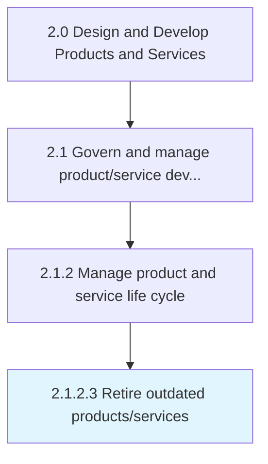
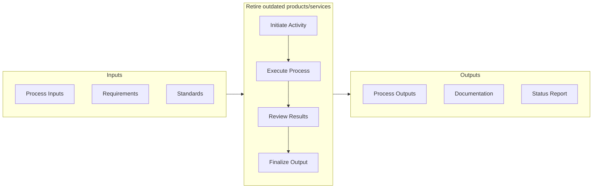

# Retire outdated products/services

> Removing nonconforming products and services.

## Overview

Activity 2.1.2.3 is an activity within the Design and Develop Products and Services framework. 

Removing nonconforming products and services. Withdraw those products/services that do not conform to market realities and are not positioned to take advantage of prevailing opportunities. Coordinate with processing/delivery teams within the organization and key stakeholders in the supply chain. Create mechanisms for continued after-sales servicing, as well as deploy effective public relations efforts in order to preserve the image and goodwill of the organization through the process.

This activity manages the orderly phase-out of products and services that no longer meet organizational or market requirements. It involves impact assessment, stakeholder communication, migration planning for affected customers, and systematic decommissioning of associated resources. Proper execution minimizes disruption and preserves customer relationships during transitions.

## Process Hierarchy



## Key Statistics

| Metric | Value |
|--------|-------|
| APQC Code | 10078 |
| Hierarchy ID | 2.1.2.3 |
| Level | Activity |
| Parent | [2.1.2](../) |
| Sub-Processes | 0 |


## GraphDL Semantic Structure

```
retire.OutdatedProductsservices
```

| Component | Value | Description |
|-----------|-------|-------------|
| Verb | `retire` | Primary action |
| Object | `outdated products/services` | Direct object |


## Related Concepts

- OutdatedProducts
- OutdatedServices


## Process Flow



## RACI Matrix

| Activity | Responsible | Accountable | Consulted | Informed |
|----------|-------------|-------------|-----------|----------|
| Define scope and objectives | Product Manager | VP of Product | Engineering Lead | Executive Team |
| Execute and document | Product Analyst | Product Manager | Quality Assurance | Stakeholders |
| Review and approve | Quality Manager | VP of Product | Legal/Compliance | Product Team |

## Related Occupations

- [Product Manager](/occupations/Management/ProductManagers) - Leads portfolio governance and lifecycle management
- [Chief Technology Officer](/occupations/Management/ChiefExecutives) - Provides strategic oversight for product development
- [Quality Assurance Manager](/occupations/Management/QualityControlSystems) - Ensures compliance with quality standards
- [Regulatory Affairs Specialist](/occupations/Legal/RegulatoryAffairs) - Manages patent, copyright, and regulatory compliance

## Related Departments

- [Product Management](/departments/ProductManagement) - Owns product portfolio strategy and governance
- [Quality Assurance](/departments/QualityAssurance) - Maintains quality standards and compliance
- [Legal & Compliance](/departments/Legal) - Manages intellectual property and regulatory requirements

## Industry Variations

### Manufacturing

Emphasizes physical product specifications, tooling requirements, and lean production principles in process execution.

### Technology

Focuses on agile development methodologies, continuous integration, and rapid iteration cycles with digital-first delivery.

### Healthcare

Requires adherence to patient safety standards, clinical efficacy validation, and comprehensive regulatory documentation.

## KPIs & Metrics

| Metric | Description | Target |
|--------|-------------|--------|
| Process Cycle Time | Average duration to complete this activity | < 10 business days |
| Completion Rate | Percentage of activities completed on schedule | > 90% |
| Stakeholder Satisfaction | Internal satisfaction score for process outputs | > 4.0/5.0 |

---

*Source: APQC PCF 10078 (2.1.2.3) - APQC*
