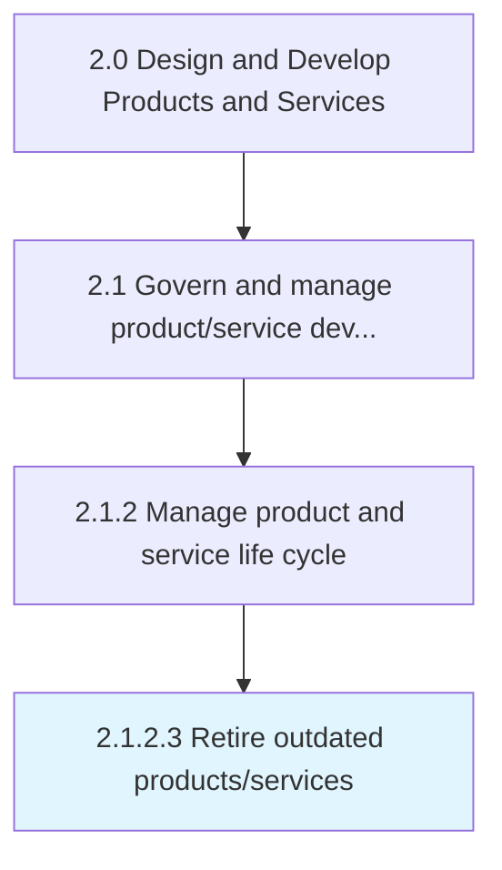

# Retire outdated products/services

> Removing nonconforming products and services.

## Overview

Activity 2.1.2.3 is an activity within the Design and Develop Products and Services framework. 

Removing nonconforming products and services. Withdraw those products/services that do not conform to market realities and are not positioned to take advantage of prevailing opportunities. Coordinate with processing/delivery teams within the organization and key stakeholders in the supply chain. Create mechanisms for continued after-sales servicing, as well as deploy effective public relations efforts in order to preserve the image and goodwill of the organization through the process.

## Process Hierarchy



## Key Statistics

| Metric | Value |
|--------|-------|
| APQC Code | 10078 |
| Hierarchy ID | 2.1.2.3 |
| Level | Activity |
| Parent | [2.1.2](../) |
| Sub-Processes | 0 |


## GraphDL Semantic Structure

```
retire.OutdatedProductsservices
```

| Component | Value | Description |
|-----------|-------|-------------|
| Verb | `retire` | Primary action |
| Object | `outdated products/services` | Direct object |


## Related Concepts

- OutdatedProducts
- OutdatedServices


---

*Source: APQC PCF 10078 (2.1.2.3) - APQC*
