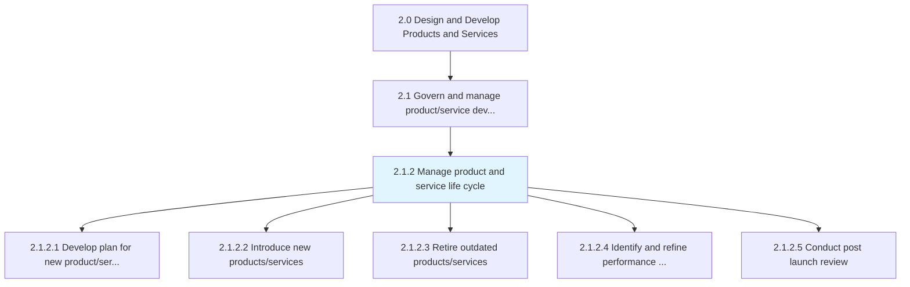
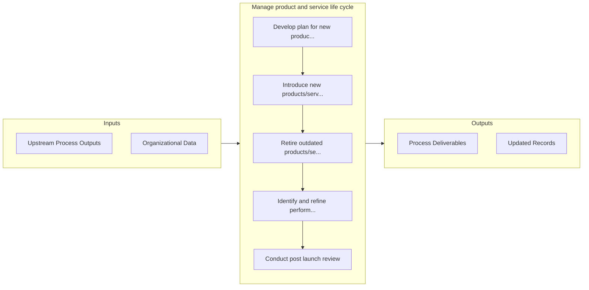

# Manage product and service life cycle

> Manage the introduction and withdrawal of products/services.

## Overview

Process 2.1.2 is a core process that defines the specific procedures for manage product and service life cycle. 

Manage the introduction and withdrawal of products/services. Administer associated changes, namely measuring the performance of new solution offerings and the revision of master files in the archives.

## Process Hierarchy



## Key Statistics

| Metric | Value |
|--------|-------|
| APQC Code | 10067 |
| Hierarchy ID | 2.1.2 |
| Level | Process |
| Parent | [2.1](../) |
| Sub-Processes | 5 |


## GraphDL Semantic Structure

```
manage.ProductAndServiceLifeCycle
```

| Component | Value | Description |
|-----------|-------|-------------|
| Verb | `manage` | Primary action |
| Object | `product and service life cycle` | Direct object |


## Process Flow



## Sub-Processes

| Process | Hierarchy ID | Description |
|---------|-------------|-------------|
| [Develop plan for new product/service development and introduction/launch](./DevelopPlanForNewProductserviceDevelopmentAndIntroductionlaunch) | 2.1.2.1 | Developing a program and managing a perspective for new product/service introduction and launch |
| [Introduce new products/services](./IntroduceNewProductsservices) | 2.1.2.2 | Launching revamped product/service portfolio in to the market |
| [Retire outdated products/services](./RetireOutdatedProductsservices) | 2.1.2.3 | Removing nonconforming products and services |
| [Identify and refine performance indicators](./IdentifyAndRefinePerformanceIndicators) | 2.1.2.4 | Attuning the performance measures of products/services to better reflect the revamped portfolio of s |
| [Conduct post launch review](./2.1.2.5-ConductPostLaunchReview/) | 2.1.2.5 | Learning from either a test or a full production run within the consumer market |


## Related Concepts

- Product
- ServiceLifeCycle


---

*Source: APQC PCF 10067 (2.1.2) - APQC*
