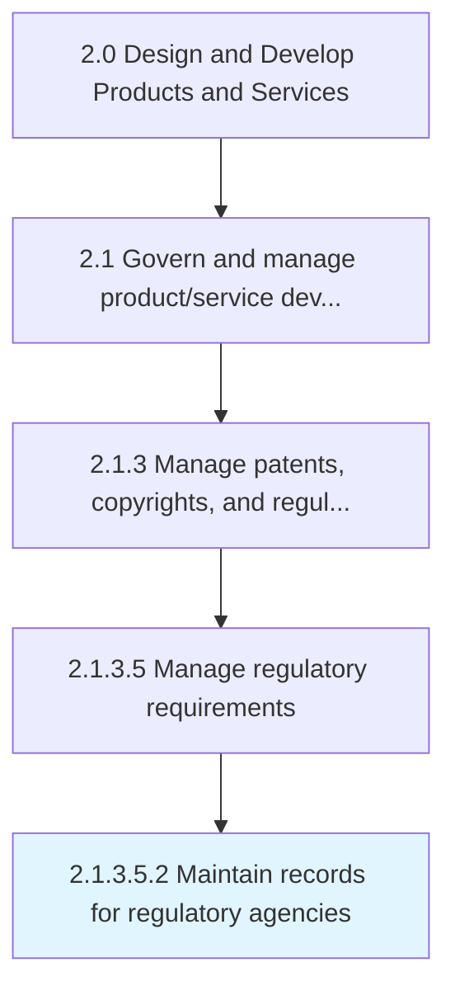

# Maintain records for regulatory agencies

> Identifying steps and procedures to manage and regularly update the records for regulatory agencies.

## Overview

Sub-Activity 2.1.3.5.2 is an activity within the Design and Develop Products and Services framework. 

Identifying steps and procedures to manage and regularly update the records for regulatory agencies. Updates will be made to safety procedures, identity and access management, software tools and applications, internal accessibility policies, internal quality parameters, etc.

## Process Hierarchy



## Key Statistics

| Metric | Value |
|--------|-------|
| APQC Code | 12773 |
| Hierarchy ID | 2.1.3.5.2 |
| Level | Sub-Activity |
| Parent | [2.1.3.5](../) |
| Sub-Processes | 0 |


## GraphDL Semantic Structure

```
maintain.Records.for.RegulatoryAgencies
```

| Component | Value | Description |
|-----------|-------|-------------|
| Verb | `maintain` | Primary action |
| Object | `records` | Direct object |
| Preposition | `for` | Relationship |
| PrepObject | `regulatory agencies` | Indirect object |


## Related Concepts

- Records
- RegulatoryAgencies


---

*Source: APQC PCF 12773 (2.1.3.5.2) - APQC*
