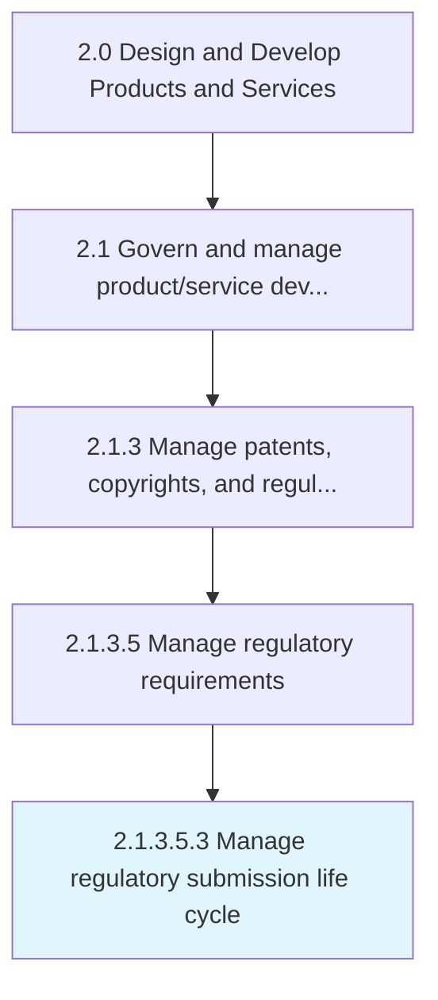

# Manage regulatory submission life cycle

> Determine and follow the timely input and update of regulatory information by assessing reforms, regulatory policies, and guidelines.

## Overview

Sub-Activity 2.1.3.5.3 is an activity within the Design and Develop Products and Services framework. 

Determine and follow the timely input and update of regulatory information by assessing reforms, regulatory policies, and guidelines.

## Process Hierarchy



## Key Statistics

| Metric | Value |
|--------|-------|
| APQC Code | 12776 |
| Hierarchy ID | 2.1.3.5.3 |
| Level | Sub-Activity |
| Parent | [2.1.3.5](../) |
| Sub-Processes | 0 |


## GraphDL Semantic Structure

```
manage.RegulatorySubmissionLifeCycle
```

| Component | Value | Description |
|-----------|-------|-------------|
| Verb | `manage` | Primary action |
| Object | `regulatory submission life cycle` | Direct object |


## Related Concepts

- [RegulatorySubmissionLifeCycle](/concepts/RegulatorySubmissionLifeCycle)


---

*Source: APQC PCF 12776 (2.1.3.5.3) - APQC*
