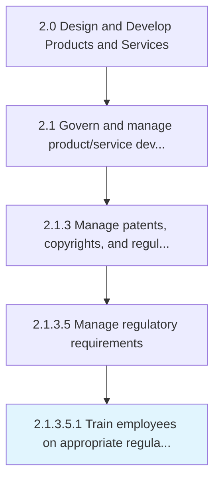

# Train employees on appropriate regulatory requirements

> Conducting training and impart learning to existing and new employees.

## Overview

Sub-Activity 2.1.3.5.1 is an activity within the Design and Develop Products and Services framework. 

Conducting training and impart learning to existing and new employees. Training will relate to the most recent/enforced regulations of the business to meet Manage regulatory requirements [12771].

## Process Hierarchy



## Key Statistics

| Metric | Value |
|--------|-------|
| APQC Code | 12772 |
| Hierarchy ID | 2.1.3.5.1 |
| Level | Sub-Activity |
| Parent | [2.1.3.5](../) |
| Sub-Processes | 0 |


## GraphDL Semantic Structure

```
train.Employees.on.AppropriateRegulatoryRequirements
```

| Component | Value | Description |
|-----------|-------|-------------|
| Verb | `train` | Primary action |
| Object | `employees` | Direct object |
| Preposition | `on` | Relationship |
| PrepObject | `appropriate regulatory requirements` | Indirect object |


## Related Concepts

- [Employees](/concepts/Employees)
- [AppropriateRegulatoryRequirements](/concepts/AppropriateRegulatoryRequirements)


---

*Source: APQC PCF 12772 (2.1.3.5.1) - APQC*
