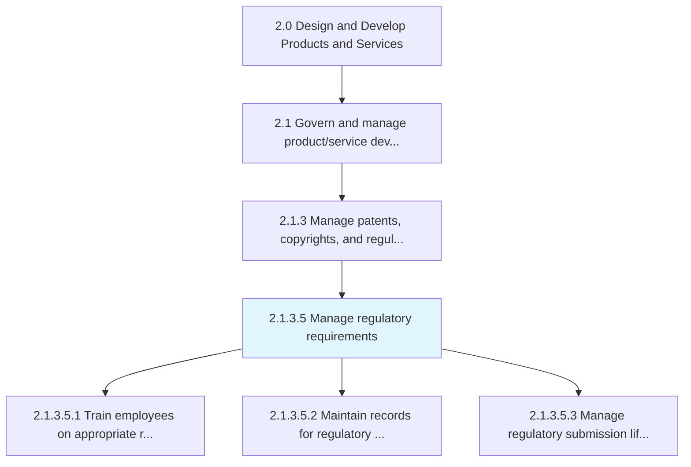
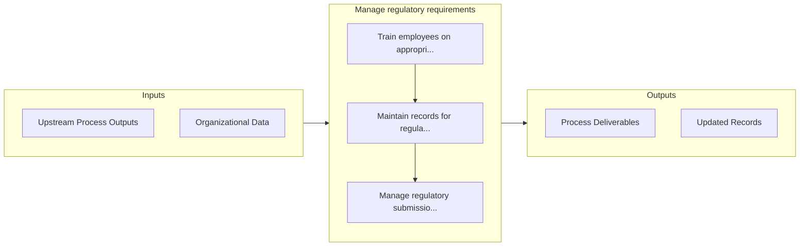

# Manage regulatory requirements

> Aligning regulatory activities related to managing industry requirements.

## Overview

Activity 2.1.3.5 is an activity within the Design and Develop Products and Services framework. 

Aligning regulatory activities related to managing industry requirements. Train employees on regulatory requirements. Records for the appropriate regulatory agencies must be maintained and the new product process must be approved by the appropriate regulatory body before it is published to the organization. The submission lifecycle - i.e. creation, review, and approval of the submission and its components must be managed in a collaborative fashion.

## Process Hierarchy



## Key Statistics

| Metric | Value |
|--------|-------|
| APQC Code | 12771 |
| Hierarchy ID | 2.1.3.5 |
| Level | Activity |
| Parent | [2.1.3](../) |
| Sub-Processes | 3 |


## GraphDL Semantic Structure

```
manage.RegulatoryRequirements
```

| Component | Value | Description |
|-----------|-------|-------------|
| Verb | `manage` | Primary action |
| Object | `regulatory requirements` | Direct object |


## Process Flow



## Sub-Processes

| Process | Hierarchy ID | Description |
|---------|-------------|-------------|
| [Train employees on appropriate regulatory requirements](./TrainEmployeesOnAppropriateRegulatoryRequirements) | 2.1.3.5.1 | Conducting training and impart learning to existing and new employees |
| [Maintain records for regulatory agencies](./MaintainRecordsForRegulatoryAgencies) | 2.1.3.5.2 | Identifying steps and procedures to manage and regularly update the records for regulatory agencies |
| [Manage regulatory submission life cycle](./ManageRegulatorySubmissionLifeCycle) | 2.1.3.5.3 | Determine and follow the timely input and update of regulatory information by assessing reforms, reg |


## Related Concepts

- RegulatoryRequirements


---

*Source: APQC PCF 12771 (2.1.3.5) - APQC*
