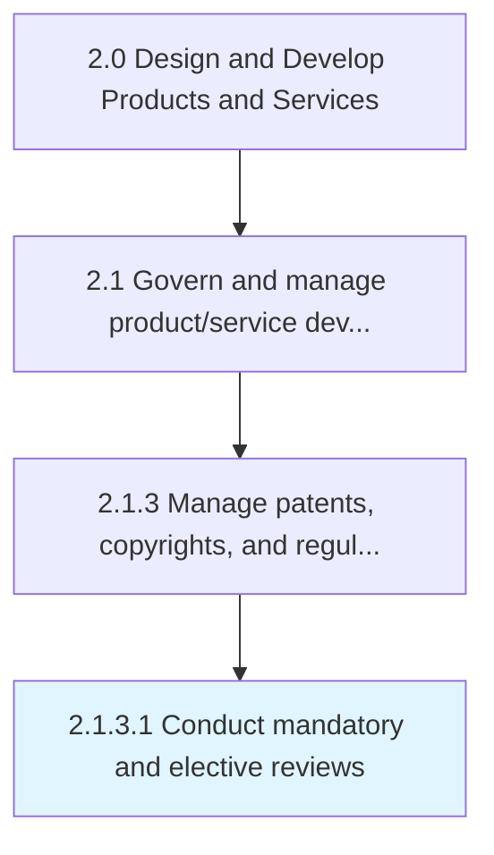

# Conduct mandatory and elective reviews

> Conducting necessary performance reviews on enforcement of processes and steps to ensure protection.

## Overview

Activity 2.1.3.1 is an activity within the Design and Develop Products and Services framework. 

Conducting necessary performance reviews on enforcement of processes and steps to ensure protection. Determine policies and reviews for Manage patents, copyrights, and regulatory requirements [19985].

## Process Hierarchy



## Key Statistics

| Metric | Value |
|--------|-------|
| APQC Code | 19941 |
| Hierarchy ID | 2.1.3.1 |
| Level | Activity |
| Parent | [2.1.3](../) |
| Sub-Processes | 0 |


## GraphDL Semantic Structure

```
conduct.MandatoryAndElectiveReviews
```

| Component | Value | Description |
|-----------|-------|-------------|
| Verb | `conduct` | Primary action |
| Object | `mandatory and elective reviews` | Direct object |


## Related Concepts

- MandatoryReviews
- ElectiveReviews


---

*Source: APQC PCF 19941 (2.1.3.1) - APQC*
