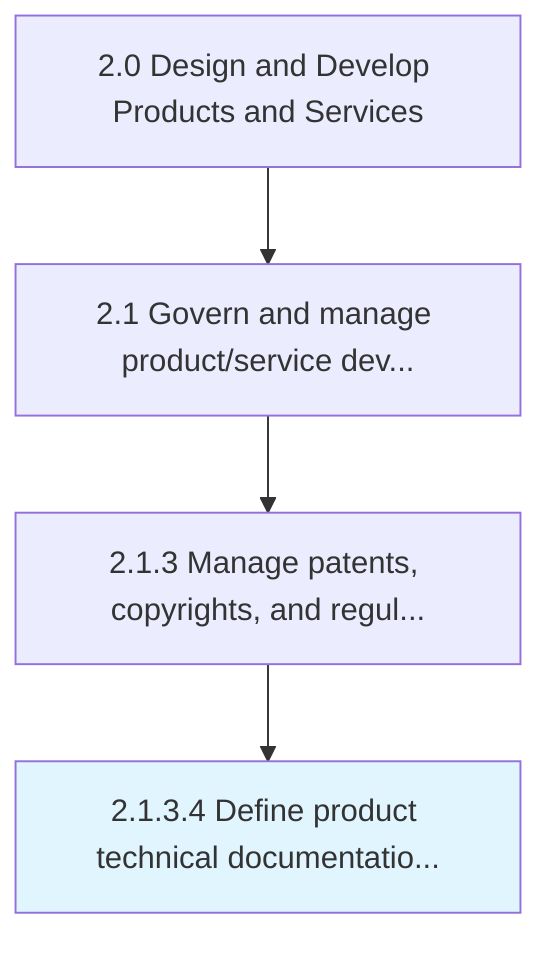
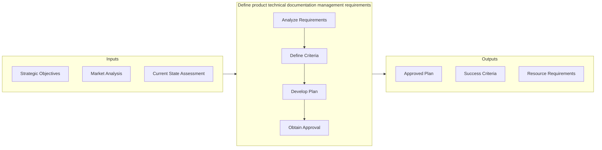
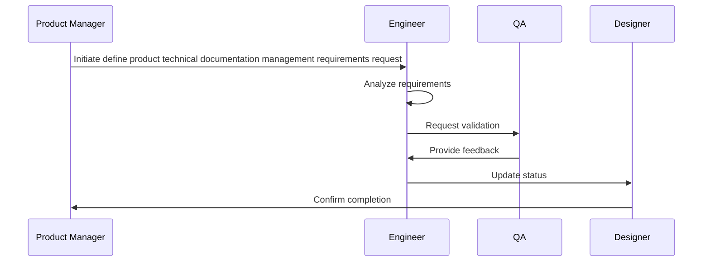

# Define product technical documentation management requirements

> Defining sourcing and procurement requirements for new product technical documentation management.

## Overview

Activity 2.1.3.4 is an activity within the Design and Develop Products and Services framework. 

Defining sourcing and procurement requirements for new product technical documentation management. Make sourcing-based decisions that identify the capabilities that will be required in order to launch the new product. This documentation will be used to support the product following entry into service. It is compiled and managed in Manage product and process related data [12082], but the capability to manage and maintain this documentation must be defined and established.

This activity ensures the ongoing accuracy, completeness, and accessibility of critical product and process data. It involves establishing governance protocols, implementing change control procedures, and conducting periodic reviews to maintain data integrity. Effective management of these records supports operational efficiency, regulatory compliance, and informed decision-making across the organization.

## Process Hierarchy



## Key Statistics

| Metric | Value |
|--------|-------|
| APQC Code | 19697 |
| Hierarchy ID | 2.1.3.4 |
| Level | Activity |
| Parent | [2.1.3](../) |
| Sub-Processes | 0 |


## GraphDL Semantic Structure

```graphdl
define.ProductTechnicalDocumentationManagementRequirements
```

| Component | Value | Description |
|-----------|-------|-------------|
| Verb | `define` | Primary action |
| Object | `product technical documentation management requirements` | Direct object |


## Related Concepts

- ProductTechnicalDocumentationManagementRequirements


## Process Flow




## Process Sequence


## RACI Matrix

| Activity | Responsible | Accountable | Consulted | Informed |
|----------|-------------|-------------|-----------|----------|
| Define scope and objectives | Product Manager | VP of Product | Engineering Lead | Executive Team |
| Execute and document | Product Analyst | Product Manager | Quality Assurance | Stakeholders |
| Review and approve | Quality Manager | VP of Product | Legal/Compliance | Product Team |

## Related Occupations

- [Product Manager](/occupations/Management/ProductManagers) - Leads portfolio governance and lifecycle management
- [Chief Technology Officer](/occupations/Management/ChiefExecutives) - Provides strategic oversight for product development
- [Quality Assurance Manager](/occupations/Management/QualityControlSystems) - Ensures compliance with quality standards
- [Regulatory Affairs Specialist](/occupations/Legal/RegulatoryAffairs) - Manages patent, copyright, and regulatory compliance

## Related Departments

- Product Management - Owns product portfolio strategy and governance
- Quality Assurance - Maintains quality standards and compliance
- [Legal & Compliance](/departments/Legal) - Manages intellectual property and regulatory requirements

## Industry Variations

### Manufacturing

Emphasizes physical product specifications, tooling requirements, and lean production principles in process execution.

### Technology

Focuses on agile development methodologies, continuous integration, and rapid iteration cycles with digital-first delivery.

### Healthcare

Requires adherence to patient safety standards, clinical efficacy validation, and comprehensive regulatory documentation.

## KPIs & Metrics

| Metric | Description | Target |
|--------|-------------|--------|
| Process Cycle Time | Average duration to complete this activity | < 10 business days |
| Completion Rate | Percentage of activities completed on schedule | > 90% |
| Stakeholder Satisfaction | Internal satisfaction score for process outputs | > 4.0/5.0 |

---

*Source: APQC PCF 19697 (2.1.3.4) - APQC*
