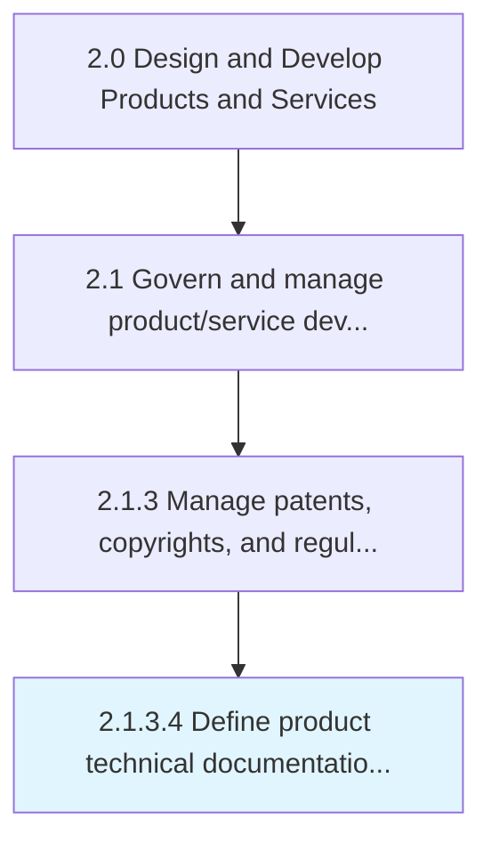

# Define product technical documentation management requirements

> Defining sourcing and procurement requirements for new product technical documentation management.

## Overview

Activity 2.1.3.4 is an activity within the Design and Develop Products and Services framework. 

Defining sourcing and procurement requirements for new product technical documentation management. Make sourcing-based decisions that identify the capabilities that will be required in order to launch the new product. This documentation will be used to support the product following entry into service. It is compiled and managed in Manage product and process related data [12082], but the capability to manage and maintain this documentation must be defined and established.

## Process Hierarchy



## Key Statistics

| Metric | Value |
|--------|-------|
| APQC Code | 19697 |
| Hierarchy ID | 2.1.3.4 |
| Level | Activity |
| Parent | [2.1.3](../) |
| Sub-Processes | 0 |


## GraphDL Semantic Structure

```
define.ProductTechnicalDocumentationManagementRequirements
```

| Component | Value | Description |
|-----------|-------|-------------|
| Verb | `define` | Primary action |
| Object | `product technical documentation management requirements` | Direct object |


## Related Concepts

- [ProductTechnicalDocumentationManagementRequirements](/concepts/ProductTechnicalDocumentationManagementRequirements)


---

*Source: APQC PCF 19697 (2.1.3.4) - APQC*
