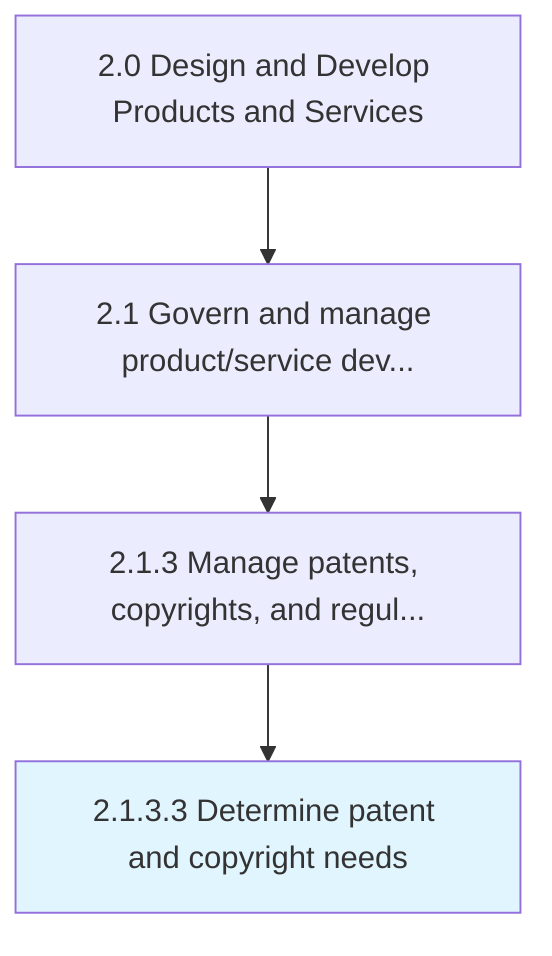

# Determine patent and copyright needs

> Determining the business need for patents and copyrights.

## Overview

Activity 2.1.3.3 is an activity within the Design and Develop Products and Services framework. 

Determining the business need for patents and copyrights. The patents and copyrights are managed by Manage copyrights and patents [11062].

## Process Hierarchy



## Key Statistics

| Metric | Value |
|--------|-------|
| APQC Code | 16827 |
| Hierarchy ID | 2.1.3.3 |
| Level | Activity |
| Parent | [2.1.3](../) |
| Sub-Processes | 0 |


## GraphDL Semantic Structure

```
determine.PatentAndCopyrightNeeds
```

| Component | Value | Description |
|-----------|-------|-------------|
| Verb | `determine` | Primary action |
| Object | `patent and copyright needs` | Direct object |


## Related Concepts

- [PatentNeeds](/concepts/PatentNeeds)
- [CopyrightNeeds](/concepts/CopyrightNeeds)


---

*Source: APQC PCF 16827 (2.1.3.3) - APQC*
