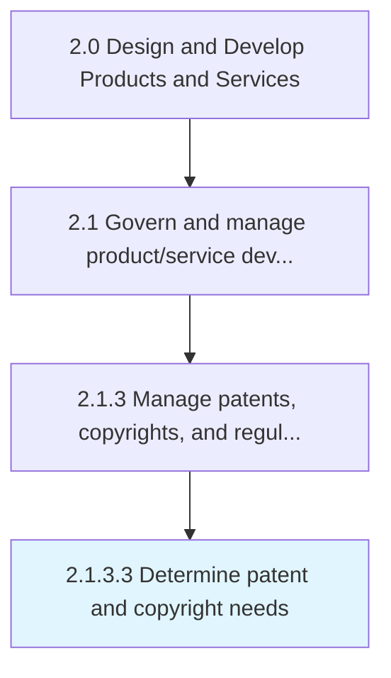
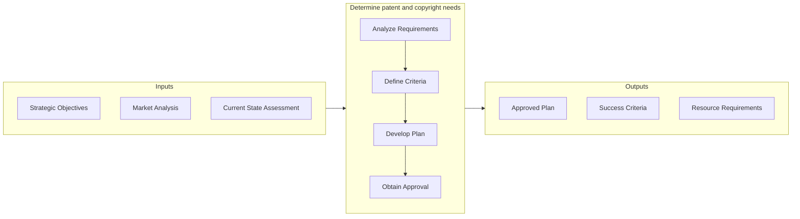
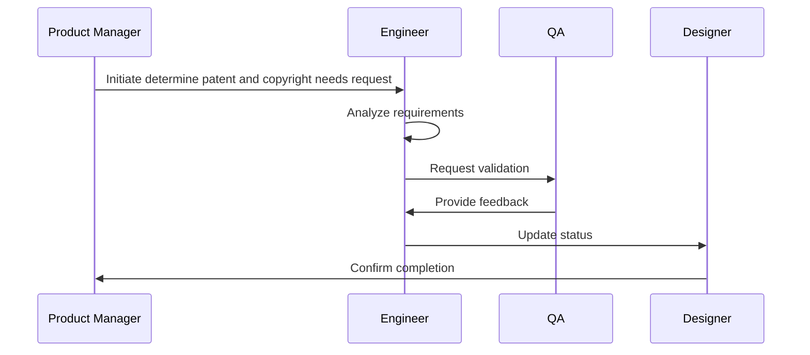

# Determine patent and copyright needs

> Determining the business need for patents and copyrights.

## Overview

Activity 2.1.3.3 is an activity within the Design and Develop Products and Services framework. 

Determining the business need for patents and copyrights. The patents and copyrights are managed by Manage copyrights and patents [11062].

This activity safeguards the organization's intellectual property and ensures adherence to all applicable regulatory frameworks. It involves systematic tracking of regulatory changes, coordination with legal counsel, and maintenance of comprehensive documentation for audit readiness. Failure to execute this process effectively can expose the organization to significant legal and financial risk.

## Process Hierarchy



## Key Statistics

| Metric | Value |
|--------|-------|
| APQC Code | 16827 |
| Hierarchy ID | 2.1.3.3 |
| Level | Activity |
| Parent | [2.1.3](../) |
| Sub-Processes | 0 |


## GraphDL Semantic Structure

```graphdl
determine.PatentAndCopyrightNeeds
```

| Component | Value | Description |
|-----------|-------|-------------|
| Verb | `determine` | Primary action |
| Object | `patent and copyright needs` | Direct object |


## Related Concepts

- PatentNeeds
- CopyrightNeeds


## Process Flow




## Process Sequence


## RACI Matrix

| Activity | Responsible | Accountable | Consulted | Informed |
|----------|-------------|-------------|-----------|----------|
| Define scope and objectives | Product Manager | VP of Product | Engineering Lead | Executive Team |
| Execute and document | Product Analyst | Product Manager | Quality Assurance | Stakeholders |
| Review and approve | Quality Manager | VP of Product | Legal/Compliance | Product Team |

## Related Occupations

- [Product Manager](/occupations/Management/ProductManagers) - Leads portfolio governance and lifecycle management
- [Chief Technology Officer](/occupations/Management/ChiefExecutives) - Provides strategic oversight for product development
- [Quality Assurance Manager](/occupations/Management/QualityControlSystems) - Ensures compliance with quality standards
- [Regulatory Affairs Specialist](/occupations/Legal/RegulatoryAffairs) - Manages patent, copyright, and regulatory compliance

## Related Departments

- Product Management - Owns product portfolio strategy and governance
- Quality Assurance - Maintains quality standards and compliance
- [Legal & Compliance](/departments/Legal) - Manages intellectual property and regulatory requirements

## Industry Variations

### Life Sciences

Regulatory requirements are extensive, involving FDA submissions, clinical trial documentation, and ongoing pharmacovigilance compliance throughout the product lifecycle.

### Aerospace & Defense

Subject to strict government regulations (FAA, ITAR), requiring detailed certification processes, export controls, and defense acquisition compliance.

### Banking & Financial Services

Must comply with financial regulations (SOX, Basel III, Dodd-Frank), requiring extensive documentation and audit trails for all product changes.

## KPIs & Metrics

| Metric | Description | Target |
|--------|-------------|--------|
| Compliance Rate | Percentage of regulatory requirements met | 100% |
| Submission Cycle Time | Time from preparation to regulatory submission | < 30 days |
| Audit Finding Resolution | Time to resolve regulatory findings | < 15 days |

---

*Source: APQC PCF 16827 (2.1.3.3) - APQC*
