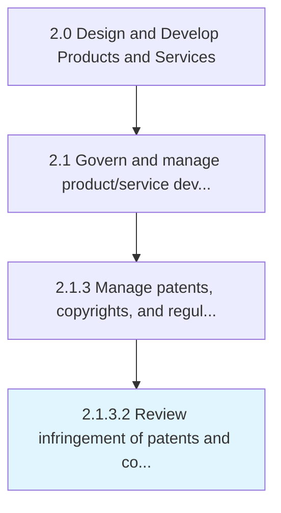
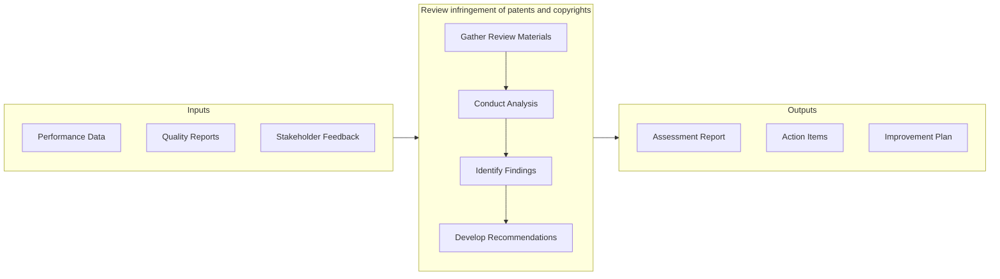

# Review infringement of patents and copyrights

> Reviewing activities in regards to patentability and infringement.

## Overview

Activity 2.1.3.2 is an activity within the Design and Develop Products and Services framework. 

Reviewing activities in regards to patentability and infringement. The usage of Open Source in commercial product development will be reviewed in regard to licensing, community development, etc.

This activity safeguards the organization's intellectual property and ensures adherence to all applicable regulatory frameworks. It involves systematic tracking of regulatory changes, coordination with legal counsel, and maintenance of comprehensive documentation for audit readiness. Failure to execute this process effectively can expose the organization to significant legal and financial risk.

## Process Hierarchy



## Key Statistics

| Metric | Value |
|--------|-------|
| APQC Code | 16826 |
| Hierarchy ID | 2.1.3.2 |
| Level | Activity |
| Parent | [2.1.3](../) |
| Sub-Processes | 0 |


## GraphDL Semantic Structure

```graphdl
review.Infringement.of.PatentsAndCopyrights
```

| Component | Value | Description |
|-----------|-------|-------------|
| Verb | `review` | Primary action |
| Object | `infringement` | Direct object |
| Preposition | `of` | Relationship |
| PrepObject | `patents and copyrights` | Indirect object |


## Related Concepts

- Infringement
- Patents
- Infringement
- Copyrights


## Process Flow



## RACI Matrix

| Activity | Responsible | Accountable | Consulted | Informed |
|----------|-------------|-------------|-----------|----------|
| Define scope and objectives | Product Manager | VP of Product | Engineering Lead | Executive Team |
| Execute and document | Product Analyst | Product Manager | Quality Assurance | Stakeholders |
| Review and approve | Quality Manager | VP of Product | Legal/Compliance | Product Team |

## Related Occupations

- [Product Manager](/occupations/Management/ProductManagers) - Leads portfolio governance and lifecycle management
- [Chief Technology Officer](/occupations/Management/ChiefExecutives) - Provides strategic oversight for product development
- [Quality Assurance Manager](/occupations/Management/QualityControlSystems) - Ensures compliance with quality standards
- [Regulatory Affairs Specialist](/occupations/Legal/RegulatoryAffairs) - Manages patent, copyright, and regulatory compliance

## Related Departments

- Product Management - Owns product portfolio strategy and governance
- Quality Assurance - Maintains quality standards and compliance
- [Legal & Compliance](/departments/Legal) - Manages intellectual property and regulatory requirements

## Industry Variations

### Life Sciences

Regulatory requirements are extensive, involving FDA submissions, clinical trial documentation, and ongoing pharmacovigilance compliance throughout the product lifecycle.

### Aerospace & Defense

Subject to strict government regulations (FAA, ITAR), requiring detailed certification processes, export controls, and defense acquisition compliance.

### Banking & Financial Services

Must comply with financial regulations (SOX, Basel III, Dodd-Frank), requiring extensive documentation and audit trails for all product changes.

## KPIs & Metrics

| Metric | Description | Target |
|--------|-------------|--------|
| Defect Rate | Percentage of defects identified per review cycle | < 2% |
| Review Cycle Time | Average time to complete review process | < 5 business days |
| First Pass Yield | Percentage of items passing review on first attempt | > 85% |

---

*Source: APQC PCF 16826 (2.1.3.2) - APQC*
