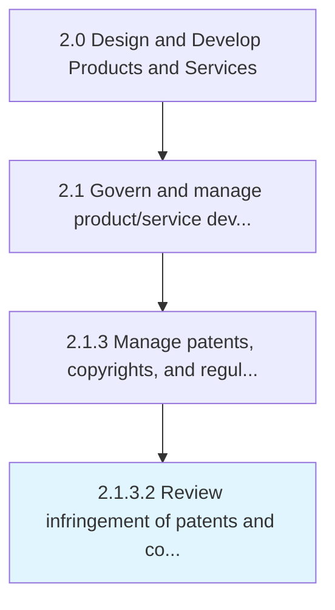

# Review infringement of patents and copyrights

> Reviewing activities in regards to patentability and infringement.

## Overview

Activity 2.1.3.2 is an activity within the Design and Develop Products and Services framework. 

Reviewing activities in regards to patentability and infringement. The usage of Open Source in commercial product development will be reviewed in regard to licensing, community development, etc.

## Process Hierarchy



## Key Statistics

| Metric | Value |
|--------|-------|
| APQC Code | 16826 |
| Hierarchy ID | 2.1.3.2 |
| Level | Activity |
| Parent | [2.1.3](../) |
| Sub-Processes | 0 |


## GraphDL Semantic Structure

```
review.Infringement.of.PatentsAndCopyrights
```

| Component | Value | Description |
|-----------|-------|-------------|
| Verb | `review` | Primary action |
| Object | `infringement` | Direct object |
| Preposition | `of` | Relationship |
| PrepObject | `patents and copyrights` | Indirect object |


## Related Concepts

- Infringement
- Patents
- Infringement
- Copyrights


---

*Source: APQC PCF 16826 (2.1.3.2) - APQC*
