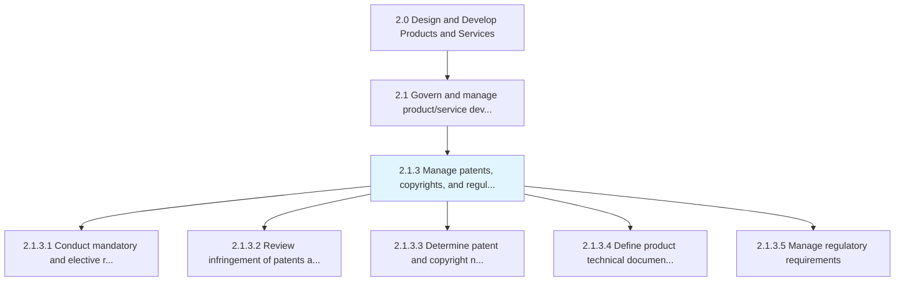
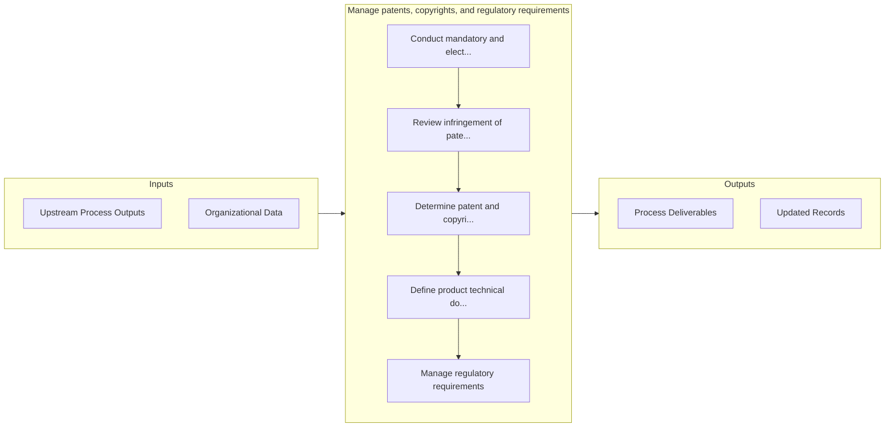

# Manage patents, copyrights, and regulatory requirements

> Determining the attributes necessary to protect and safeguard intellectual assets, maximize the value of IP assets through streamlined process, and collaboration between departments.

## Overview

Process 2.1.3 is a core process that defines the specific procedures for manage patents, copyrights, and regulatory requirements. 

Determining the attributes necessary to protect and safeguard intellectual assets, maximize the value of IP assets through streamlined process, and collaboration between departments. Focus on needs to safeguard, critical assets, and assets' value.

## Process Hierarchy



## Key Statistics

| Metric | Value |
|--------|-------|
| APQC Code | 19985 |
| Hierarchy ID | 2.1.3 |
| Level | Process |
| Parent | [2.1](../) |
| Sub-Processes | 5 |


## GraphDL Semantic Structure

```graphdl
manage.PatentsCopyrightsAndRegulatoryRequirements
```

| Component | Value | Description |
|-----------|-------|-------------|
| Verb | `manage` | Primary action |
| Object | `patents, copyrights, and regulatory requirements` | Direct object |


## Process Flow



## Sub-Processes

| Process | Hierarchy ID | Description |
|---------|-------------|-------------|
| [Conduct mandatory and elective reviews](./ConductMandatoryAndElectiveReviews) | 2.1.3.1 | Conducting necessary performance reviews on enforcement of processes and steps to ensure protection |
| [Review infringement of patents and copyrights](./ReviewInfringementOfPatentsAndCopyrights) | 2.1.3.2 | Reviewing activities in regards to patentability and infringement |
| [Determine patent and copyright needs](./DeterminePatentAndCopyrightNeeds) | 2.1.3.3 | Determining the business need for patents and copyrights |
| [Define product technical documentation management requirements](./DefineProductTechnicalDocumentationManagementRequirements) | 2.1.3.4 | Defining sourcing and procurement requirements for new product technical documentation management |
| [Manage regulatory requirements](./2.1.3.5-ManageRegulatoryRequirements/) | 2.1.3.5 | Aligning regulatory activities related to managing industry requirements |


## Related Concepts

- Patents
- Copyrights
- RegulatoryRequirements


---

*Source: APQC PCF 19985 (2.1.3) - APQC*
