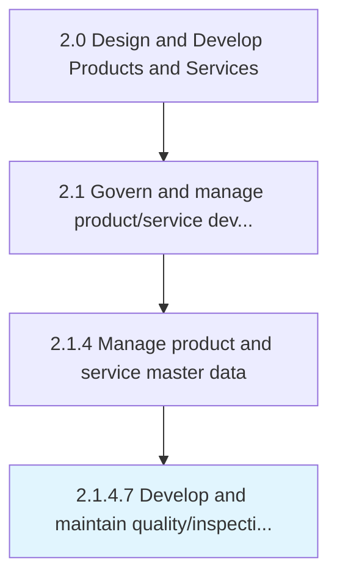
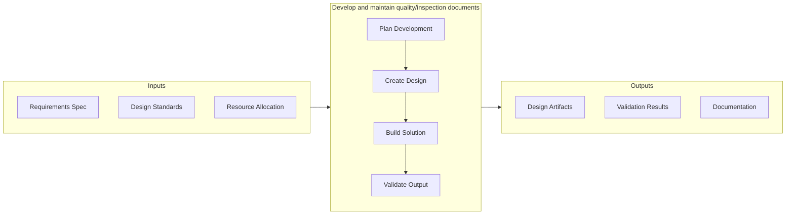

# Develop and maintain quality/inspection documents

> Determining procedures required to assess the sustainability of defined criterion for product/service delivery to customers.

## Overview

Activity 2.1.4.7 is an activity within the Design and Develop Products and Services framework. 

Determining procedures required to assess the sustainability of defined criterion for product/service delivery to customers. Retain results for further review as a procedural practice.

This activity is critical to ensuring that products and services meet established quality benchmarks before advancing through subsequent development stages. It involves systematic evaluation against predefined criteria, cross-functional collaboration to address identified gaps, and documentation of findings to support continuous improvement. The process draws on both quantitative metrics and qualitative assessments from subject matter experts.

## Process Hierarchy



## Key Statistics

| Metric | Value |
|--------|-------|
| APQC Code | 11747 |
| Hierarchy ID | 2.1.4.7 |
| Level | Activity |
| Parent | [2.1.4](../) |
| Sub-Processes | 0 |


## GraphDL Semantic Structure

```graphdl
develop.AndMaintainQualityinspectionDocuments
```

| Component | Value | Description |
|-----------|-------|-------------|
| Verb | `develop` | Primary action |
| Object | `and maintain quality/inspection documents` | Direct object |


## Related Concepts

- QualityDocuments
- InspectionDocuments
- QualityDocuments
- InspectionDocuments


## Process Flow



## RACI Matrix

| Activity | Responsible | Accountable | Consulted | Informed |
|----------|-------------|-------------|-----------|----------|
| Define scope and objectives | Product Manager | VP of Product | Engineering Lead | Executive Team |
| Execute and document | Product Analyst | Product Manager | Quality Assurance | Stakeholders |
| Review and approve | Quality Manager | VP of Product | Legal/Compliance | Product Team |

## Related Occupations

- [Product Manager](/occupations/Management/ProductManagers) - Leads portfolio governance and lifecycle management
- [Chief Technology Officer](/occupations/Management/ChiefExecutives) - Provides strategic oversight for product development
- [Quality Assurance Manager](/occupations/Management/QualityControlSystems) - Ensures compliance with quality standards
- [Regulatory Affairs Specialist](/occupations/Legal/RegulatoryAffairs) - Manages patent, copyright, and regulatory compliance

## Related Departments

- Product Management - Owns product portfolio strategy and governance
- Quality Assurance - Maintains quality standards and compliance
- [Legal & Compliance](/departments/Legal) - Manages intellectual property and regulatory requirements

## Industry Variations

### Manufacturing

Emphasizes physical product specifications, tooling requirements, and lean production principles in process execution.

### Technology

Focuses on agile development methodologies, continuous integration, and rapid iteration cycles with digital-first delivery.

### Healthcare

Requires adherence to patient safety standards, clinical efficacy validation, and comprehensive regulatory documentation.

## KPIs & Metrics

| Metric | Description | Target |
|--------|-------------|--------|
| Defect Rate | Percentage of defects identified per review cycle | < 2% |
| Review Cycle Time | Average time to complete review process | < 5 business days |
| First Pass Yield | Percentage of items passing review on first attempt | > 85% |

---

*Source: APQC PCF 11747 (2.1.4.7) - APQC*
