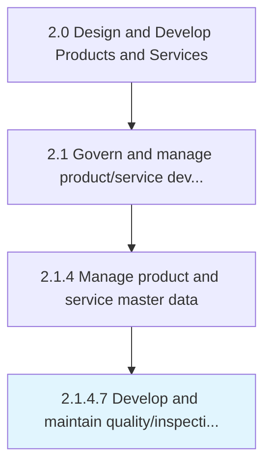

# Develop and maintain quality/inspection documents

> Determining procedures required to assess the sustainability of defined criterion for product/service delivery to customers.

## Overview

Activity 2.1.4.7 is an activity within the Design and Develop Products and Services framework. 

Determining procedures required to assess the sustainability of defined criterion for product/service delivery to customers. Retain results for further review as a procedural practice.

## Process Hierarchy



## Key Statistics

| Metric | Value |
|--------|-------|
| APQC Code | 11747 |
| Hierarchy ID | 2.1.4.7 |
| Level | Activity |
| Parent | [2.1.4](../) |
| Sub-Processes | 0 |


## GraphDL Semantic Structure

```
develop.AndMaintainQualityinspectionDocuments
```

| Component | Value | Description |
|-----------|-------|-------------|
| Verb | `develop` | Primary action |
| Object | `and maintain quality/inspection documents` | Direct object |


## Related Concepts

- [QualityDocuments](/concepts/QualityDocuments)
- [InspectionDocuments](/concepts/InspectionDocuments)
- [QualityDocuments](/concepts/QualityDocuments)
- [InspectionDocuments](/concepts/InspectionDocuments)


---

*Source: APQC PCF 11747 (2.1.4.7) - APQC*
