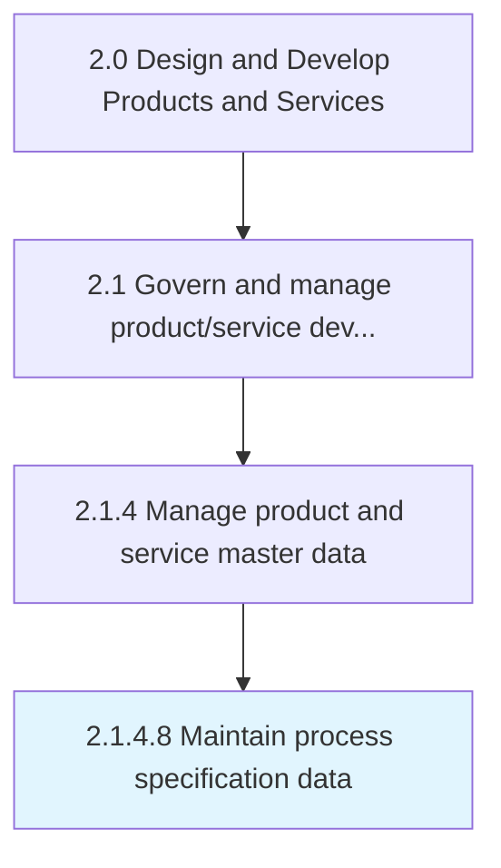

# Maintain process specification data

> Directing and handling data with respect to the procedures followed across different functions and mission critical applications.

## Overview

Activity 2.1.4.8 is an activity within the Design and Develop Products and Services framework. 

Directing and handling data with respect to the procedures followed across different functions and mission critical applications.

## Process Hierarchy



## Key Statistics

| Metric | Value |
|--------|-------|
| APQC Code | 11748 |
| Hierarchy ID | 2.1.4.8 |
| Level | Activity |
| Parent | [2.1.4](../) |
| Sub-Processes | 0 |


## GraphDL Semantic Structure

```
maintain.ProcessSpecificationData
```

| Component | Value | Description |
|-----------|-------|-------------|
| Verb | `maintain` | Primary action |
| Object | `process specification data` | Direct object |


## Related Concepts

- ProcessSpecificationData


---

*Source: APQC PCF 11748 (2.1.4.8) - APQC*
