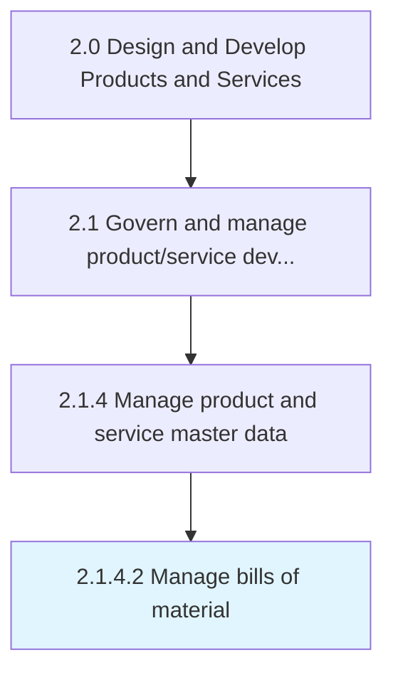

# Manage bills of material

> Managing the purchase details/bills through regular and error free updates to applications.

## Overview

Activity 2.1.4.2 is an activity within the Design and Develop Products and Services framework. 

Managing the purchase details/bills through regular and error free updates to applications. Create manual entries wherever necessary and ensure timely review of the laid processes and systems.

## Process Hierarchy



## Key Statistics

| Metric | Value |
|--------|-------|
| APQC Code | 11742 |
| Hierarchy ID | 2.1.4.2 |
| Level | Activity |
| Parent | [2.1.4](../) |
| Sub-Processes | 0 |


## GraphDL Semantic Structure

```
manage.Bills.of.Material
```

| Component | Value | Description |
|-----------|-------|-------------|
| Verb | `manage` | Primary action |
| Object | `bills` | Direct object |
| Preposition | `of` | Relationship |
| PrepObject | `material` | Indirect object |


## Related Concepts

- [Bills](/concepts/Bills)
- [Material](/concepts/Material)


---

*Source: APQC PCF 11742 (2.1.4.2) - APQC*
