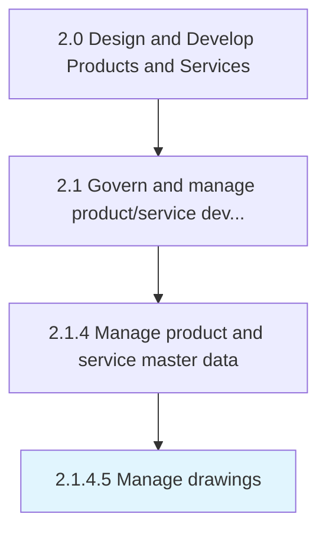

# Manage drawings

> Administering the specifications of the product/service and ensure accessibility for product alteration/new product development.

## Overview

Activity 2.1.4.5 is an activity within the Design and Develop Products and Services framework. 

Administering the specifications of the product/service and ensure accessibility for product alteration/new product development.

## Process Hierarchy



## Key Statistics

| Metric | Value |
|--------|-------|
| APQC Code | 11745 |
| Hierarchy ID | 2.1.4.5 |
| Level | Activity |
| Parent | [2.1.4](../) |
| Sub-Processes | 0 |


## GraphDL Semantic Structure

```
manage.Drawings
```

| Component | Value | Description |
|-----------|-------|-------------|
| Verb | `manage` | Primary action |
| Object | `drawings` | Direct object |


## Related Concepts

- Drawings


---

*Source: APQC PCF 11745 (2.1.4.5) - APQC*
