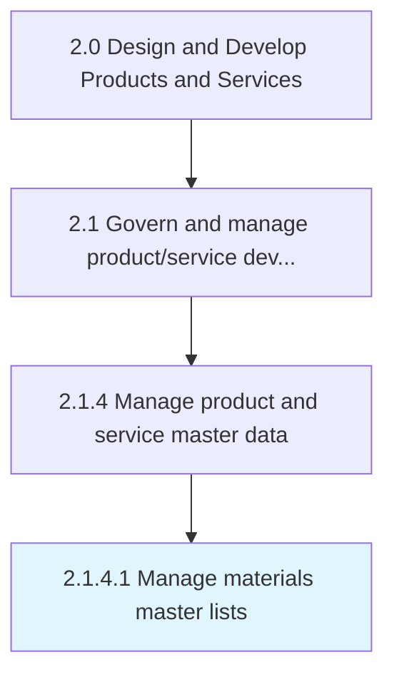

# Manage materials master lists

> Controlling the details of materials' storage and utilization, supplier details linked to materials, in a defined sequential manner and ensuring regular updates with permissible accessibility.

## Overview

Activity 2.1.4.1 is an activity within the Design and Develop Products and Services framework. 

Controlling the details of materials' storage and utilization, supplier details linked to materials, in a defined sequential manner and ensuring regular updates with permissible accessibility.

## Process Hierarchy



## Key Statistics

| Metric | Value |
|--------|-------|
| APQC Code | 11741 |
| Hierarchy ID | 2.1.4.1 |
| Level | Activity |
| Parent | [2.1.4](../) |
| Sub-Processes | 0 |


## GraphDL Semantic Structure

```
manage.MaterialsMasterLists
```

| Component | Value | Description |
|-----------|-------|-------------|
| Verb | `manage` | Primary action |
| Object | `materials master lists` | Direct object |


## Related Concepts

- MaterialsMasterLists


---

*Source: APQC PCF 11741 (2.1.4.1) - APQC*
