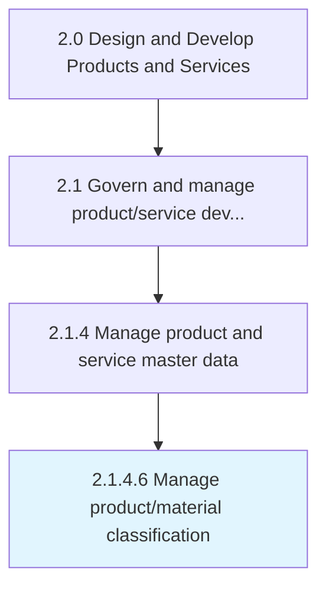

# Manage product/material classification

> Controlling the details of the product and the input materials.

## Overview

Activity 2.1.4.6 is an activity within the Design and Develop Products and Services framework. 

Controlling the details of the product and the input materials. Manage classification throughout the production process, and for future accessibility to new product development or product enrichment.

## Process Hierarchy



## Key Statistics

| Metric | Value |
|--------|-------|
| APQC Code | 11746 |
| Hierarchy ID | 2.1.4.6 |
| Level | Activity |
| Parent | [2.1.4](../) |
| Sub-Processes | 0 |


## GraphDL Semantic Structure

```
manage.ProductmaterialClassification
```

| Component | Value | Description |
|-----------|-------|-------------|
| Verb | `manage` | Primary action |
| Object | `product/material classification` | Direct object |


## Related Concepts

- [ProductClassification](/concepts/ProductClassification)
- [MaterialClassification](/concepts/MaterialClassification)


---

*Source: APQC PCF 11746 (2.1.4.6) - APQC*
