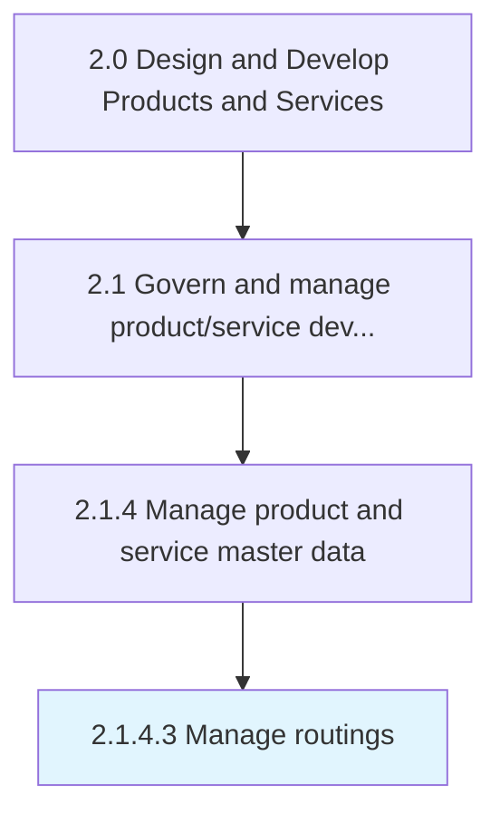

# Manage routings

> Controlling and executing the flow of operations from raw form to finished product in a defined format using industry applications/routing sheets for the specific product/service layout.

## Overview

Activity 2.1.4.3 is an activity within the Design and Develop Products and Services framework. 

Controlling and executing the flow of operations from raw form to finished product in a defined format using industry applications/routing sheets for the specific product/service layout.

## Process Hierarchy



## Key Statistics

| Metric | Value |
|--------|-------|
| APQC Code | 11743 |
| Hierarchy ID | 2.1.4.3 |
| Level | Activity |
| Parent | [2.1.4](../) |
| Sub-Processes | 0 |


## GraphDL Semantic Structure

```
manage.Routings
```

| Component | Value | Description |
|-----------|-------|-------------|
| Verb | `manage` | Primary action |
| Object | `routings` | Direct object |


## Related Concepts

- [Routings](/concepts/Routings)


---

*Source: APQC PCF 11743 (2.1.4.3) - APQC*
