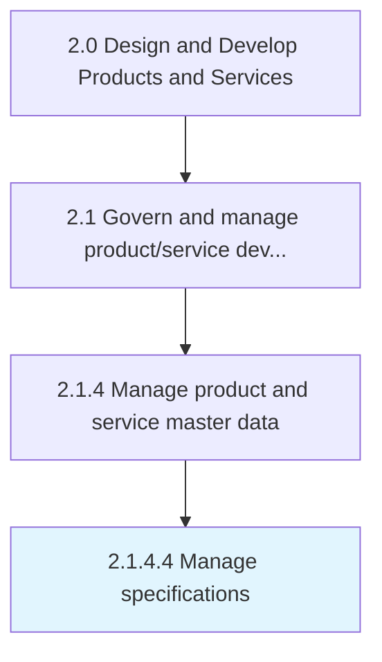

# Manage specifications

> Direct, supervise, and control the product/service details necessary to execute the process.

## Overview

Activity 2.1.4.4 is an activity within the Design and Develop Products and Services framework. 

Direct, supervise, and control the product/service details necessary to execute the process. Adhere to details and descriptions for product/service through identified or guided parameters towards final outcome in the market with due critical analysis formed on organizational objectives.

## Process Hierarchy



## Key Statistics

| Metric | Value |
|--------|-------|
| APQC Code | 11744 |
| Hierarchy ID | 2.1.4.4 |
| Level | Activity |
| Parent | [2.1.4](../) |
| Sub-Processes | 0 |


## GraphDL Semantic Structure

```
manage.Specifications
```

| Component | Value | Description |
|-----------|-------|-------------|
| Verb | `manage` | Primary action |
| Object | `specifications` | Direct object |


## Related Concepts

- [Specifications](/concepts/Specifications)


---

*Source: APQC PCF 11744 (2.1.4.4) - APQC*
