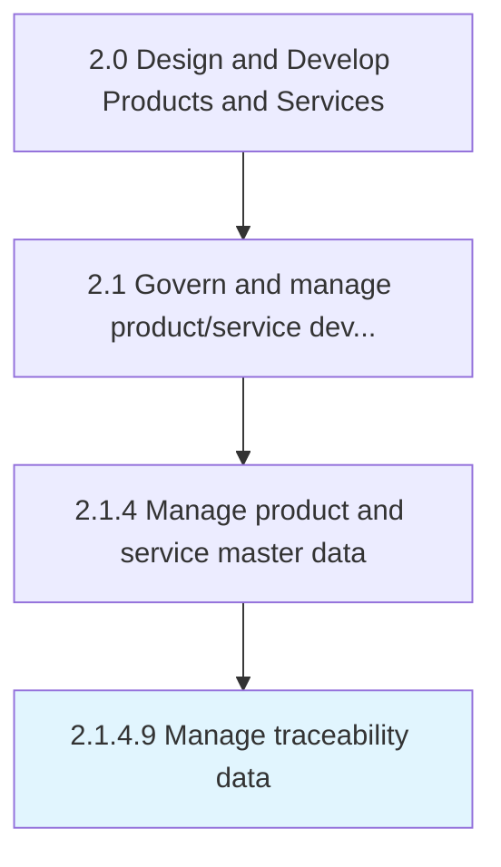

# Manage traceability data

> Identifying and handling data accessed by the permitted touch points.

## Overview

Activity 2.1.4.9 is an activity within the Design and Develop Products and Services framework. 

Identifying and handling data accessed by the permitted touch points. Ensure that no data is accessible to any unnecessary recipient. Data flow should be controlled through secured access and free from unauthorized access.

## Process Hierarchy



## Key Statistics

| Metric | Value |
|--------|-------|
| APQC Code | 11749 |
| Hierarchy ID | 2.1.4.9 |
| Level | Activity |
| Parent | [2.1.4](../) |
| Sub-Processes | 0 |


## GraphDL Semantic Structure

```
manage.TraceabilityData
```

| Component | Value | Description |
|-----------|-------|-------------|
| Verb | `manage` | Primary action |
| Object | `traceability data` | Direct object |


## Related Concepts

- TraceabilityData


---

*Source: APQC PCF 11749 (2.1.4.9) - APQC*
