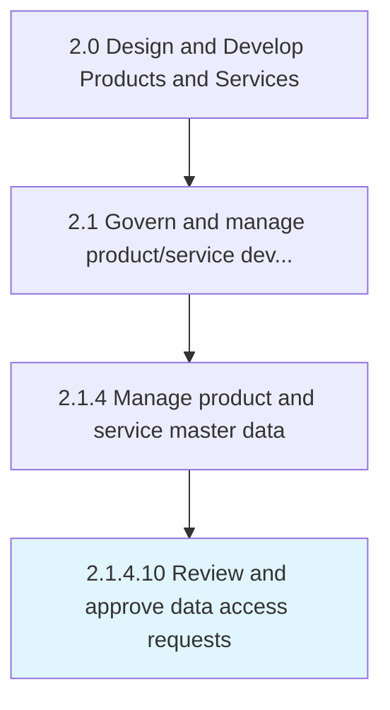

# Review and approve data access requests

> Determining the requests pertaining to data accessibility.

## Overview

Activity 2.1.4.10 is an activity within the Design and Develop Products and Services framework. 

Determining the requests pertaining to data accessibility. Review the requester details based on internal data security policies and permit data access only if internal policies and data access parameters are met.

## Process Hierarchy



## Key Statistics

| Metric | Value |
|--------|-------|
| APQC Code | 11750 |
| Hierarchy ID | 2.1.4.10 |
| Level | Activity |
| Parent | [2.1.4](../) |
| Sub-Processes | 0 |


## GraphDL Semantic Structure

```
review.AndApproveDataAccessRequests
```

| Component | Value | Description |
|-----------|-------|-------------|
| Verb | `review` | Primary action |
| Object | `and approve data access requests` | Direct object |


## Related Concepts

- [DataAccessRequests](/concepts/DataAccessRequests)
- [DataAccessRequests](/concepts/DataAccessRequests)


---

*Source: APQC PCF 11750 (2.1.4.10) - APQC*
