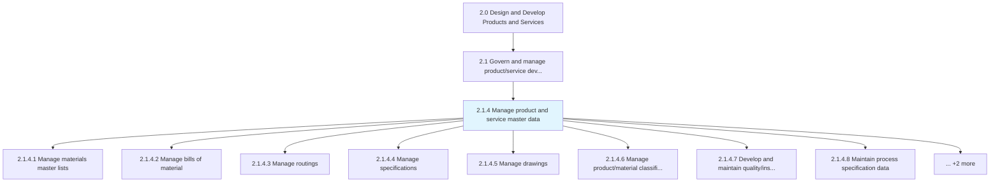
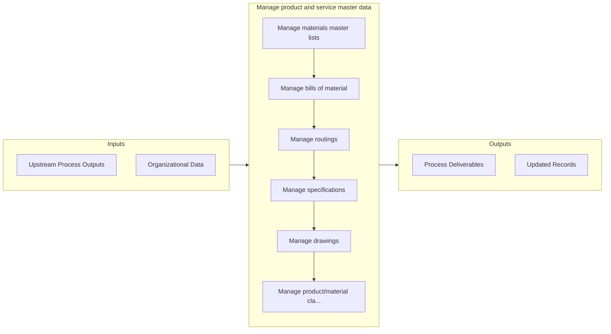

# Manage product and service master data

> Controlling/authorizing to enable services' and products' data and other critical data of these functions through a well secured storage and accessibility processes backed by siloed applications/IT systems.

## Overview

Process 2.1.4 is a core process that defines the specific procedures for manage product and service master data. 

Controlling/authorizing to enable services' and products' data and other critical data of these functions through a well secured storage and accessibility processes backed by siloed applications/IT systems.

## Process Hierarchy



## Key Statistics

| Metric | Value |
|--------|-------|
| APQC Code | 11740 |
| Hierarchy ID | 2.1.4 |
| Level | Process |
| Parent | [2.1](../) |
| Sub-Processes | 10 |


## GraphDL Semantic Structure

```
manage.ProductAndServiceMasterData
```

| Component | Value | Description |
|-----------|-------|-------------|
| Verb | `manage` | Primary action |
| Object | `product and service master data` | Direct object |


## Process Flow



## Sub-Processes

| Process | Hierarchy ID | Description |
|---------|-------------|-------------|
| [Manage materials master lists](./ManageMaterialsMasterLists) | 2.1.4.1 | Controlling the details of materials' storage and utilization, supplier details linked to materials, |
| [Manage bills of material](./ManageBillsOfMaterial) | 2.1.4.2 | Managing the purchase details/bills through regular and error free updates to applications |
| [Manage routings](./ManageRoutings) | 2.1.4.3 | Controlling and executing the flow of operations from raw form to finished product in a defined form |
| [Manage specifications](./ManageSpecifications) | 2.1.4.4 | Direct, supervise, and control the product/service details necessary to execute the process |
| [Manage drawings](./ManageDrawings) | 2.1.4.5 | Administering the specifications of the product/service and ensure accessibility for product alterat |
| [Manage product/material classification](./ManageProductmaterialClassification) | 2.1.4.6 | Controlling the details of the product and the input materials |
| [Develop and maintain quality/inspection documents](./DevelopAndMaintainQualityinspectionDocuments) | 2.1.4.7 | Determining procedures required to assess the sustainability of defined criterion for product/servic |
| [Maintain process specification data](./MaintainProcessSpecificationData) | 2.1.4.8 | Directing and handling data with respect to the procedures followed across different functions and m |
| [Manage traceability data](./ManageTraceabilityData) | 2.1.4.9 | Identifying and handling data accessed by the permitted touch points |
| [Review and approve data access requests](./ReviewAndApproveDataAccessRequests) | 2.1.4.10 | Determining the requests pertaining to data accessibility |


## Related Concepts

- Product
- ServiceMasterData


---

*Source: APQC PCF 11740 (2.1.4) - APQC*
