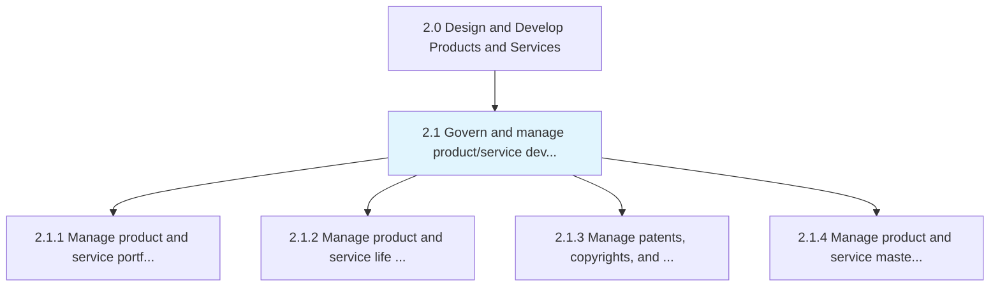
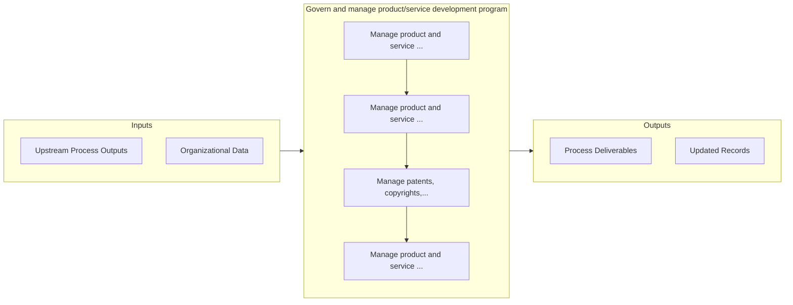

# Govern and manage product/service development program

> Supervising the complete product/service program from innovation until its commercial success.

## Overview

Group 2.1 is a process group within APQC Category 2.0 (Design and Develop Products and Services). 

Supervising the complete product/service program from innovation until its commercial success. Meeting the customer demand and expectations. Conduct further development and innovation pertaining to business goals.

## Process Hierarchy



## Key Statistics

| Metric | Value |
|--------|-------|
| APQC Code | 19696 |
| Hierarchy ID | 2.1 |
| Level | Group |
| Parent | [2](../) |
| Sub-Processes | 4 |


## GraphDL Semantic Structure

```graphdl
govern.AndManageProductserviceDevelopmentProgram
```

| Component | Value | Description |
|-----------|-------|-------------|
| Verb | `govern` | Primary action |
| Object | `and manage product/service development program` | Direct object |


## Process Flow



## Sub-Processes

| Process | Hierarchy ID | Description |
|---------|-------------|-------------|
| [Manage product and service portfolio](./2.1.1-ManageProductServicePortfolio/) | 2.1.1 | Managing a portfolio of product/service offerings to take advantage of shifts in the market expectat |
| [Manage product and service life cycle](./2.1.2-ManageProductServiceLife/) | 2.1.2 | Manage the introduction and withdrawal of products/services |
| [Manage patents, copyrights, and regulatory requirements](./2.1.3-ManagePatentsCopyrightsRegulatory/) | 2.1.3 | Determining the attributes necessary to protect and safeguard intellectual assets, maximize the valu |
| [Manage product and service master data](./2.1.4-ManageProductServiceMaster/) | 2.1.4 | Controlling/authorizing to enable services' and products' data and other critical data of these func |


## Related Concepts

- ProductDevelopmentProgram
- ServiceDevelopmentProgram
- ProductDevelopmentProgram
- ServiceDevelopmentProgram


---

*Source: APQC PCF 19696 (2.1) - APQC*
