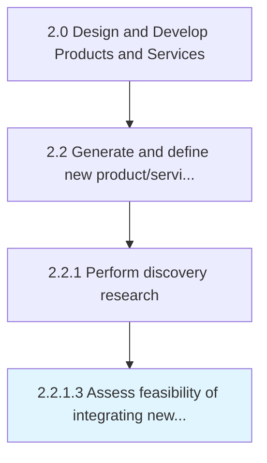
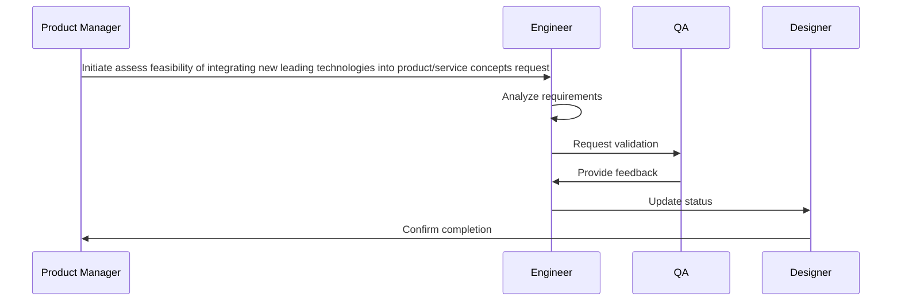

# Assess feasibility of integrating new leading technologies into product/service concepts

> Appraising the feasibility of integrating new technologies, whether developed as a custom solution or adopted from an external source, into revised portfolio of solution offerings.

## Overview

Activity 2.2.1.3 is an activity within the Design and Develop Products and Services framework. 

Appraising the feasibility of integrating new technologies, whether developed as a custom solution or adopted from an external source, into revised portfolio of solution offerings. Examine recently developed technological advances for suitability to incorporate them into the concept of revised and/or new solution offerings. Enlist senior management, in consultation with in-house personnel responsible for the design, processing, and delivery of these solutions, as well as key supply-chain stakeholders.

## Process Hierarchy



## Key Statistics

| Metric | Value |
|--------|-------|
| APQC Code | 10072 |
| Hierarchy ID | 2.2.1.3 |
| Level | Activity |
| Parent | [2.2.1](../) |
| Sub-Processes | 0 |


## Process Overview

Product development processes design, develop, and introduce new products and services to meet customer needs. This process focuses on assess feasibility of integrating new leading technologies into product/service concepts, which is essential for organizational effectiveness and achieving business objectives.

## Key Metrics

| Metric | Description | Target |
|--------|-------------|--------|
| Time to market | Measure of time to market | Target varies by organization |
| Product success rate | Measure of product success rate | Target varies by organization |
| R&D ROI | Measure of r&d roi | Target varies by organization |
| Patent filings | Measure of patent filings | Target varies by organization |

## Related Departments

- [Product](/departments/Product)
- [Research](/departments/Research)
- [Quality](/departments/Quality)

## Related Occupations

- [Product Managers](/occupations/Management/ProductManagers)
- [Industrial Engineers](/occupations/Engineering/IndustrialEngineers)
- [Quality Control Managers](/occupations/Management/QualityControlManagers)

## RACI Matrix

| Activity | Responsible | Accountable | Consulted | Informed |
|----------|-------------|-------------|-----------|----------|
| Plan | Process Owner | Manager | Stakeholders | Team |
| Execute | Team | Process Owner | Manager | Stakeholders |
| Monitor | Analyst | Manager | Process Owner | Leadership |
| Improve | Process Owner | Manager | Team | Stakeholders |

## GraphDL Semantic Structure

```graphdl
assess.Feasibility.of.IntegratingNewLeadingTechnologiesIntoProductserviceConcepts
```

| Component | Value | Description |
|-----------|-------|-------------|
| Verb | `assess` | Primary action |
| Object | `feasibility` | Direct object |
| Preposition | `of` | Relationship |
| PrepObject | `integrating new leading technologies into product/service concepts` | Indirect object |


## Process Sequence


## Related Concepts

- Feasibility
- IntegratingNewLeadingTechnologiesIntoProductConcepts
- Feasibility
- IntegratingNewLeadingTechnologiesIntoServiceConcepts


---

*Source: APQC PCF 10072 (2.2.1.3) - APQC*
