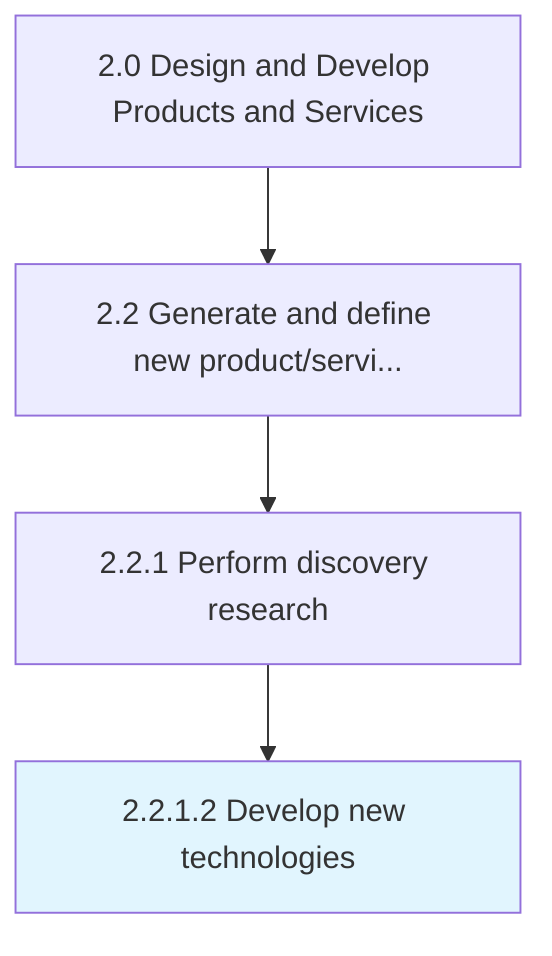

# Develop new technologies

> Developing new technologies from scratch to integrate into a revised portfolio of solutions.

## Overview

Activity 2.2.1.2 is an activity within the Design and Develop Products and Services framework. 

Developing new technologies from scratch to integrate into a revised portfolio of solutions. Develop new technological processes, models, and/or implements in-house, with the objective of improving existing solutions or creating new ones. Consider market realities, as well as the portfolio of products/services. Assess the results in conjunction with senior executives and personnel responsible for the design, processing, and delivery of these solutions. Engage the R&D function, and consider external sources such as offshore providers, specialized research agencies, and crowdsourcing communities.

## Process Hierarchy



## Key Statistics

| Metric | Value |
|--------|-------|
| APQC Code | 10071 |
| Hierarchy ID | 2.2.1.2 |
| Level | Activity |
| Parent | [2.2.1](../) |
| Sub-Processes | 0 |


## GraphDL Semantic Structure

```
develop.NewTechnologies
```

| Component | Value | Description |
|-----------|-------|-------------|
| Verb | `develop` | Primary action |
| Object | `new technologies` | Direct object |


## Related Concepts

- [NewTechnologies](/concepts/NewTechnologies)


---

*Source: APQC PCF 10071 (2.2.1.2) - APQC*
