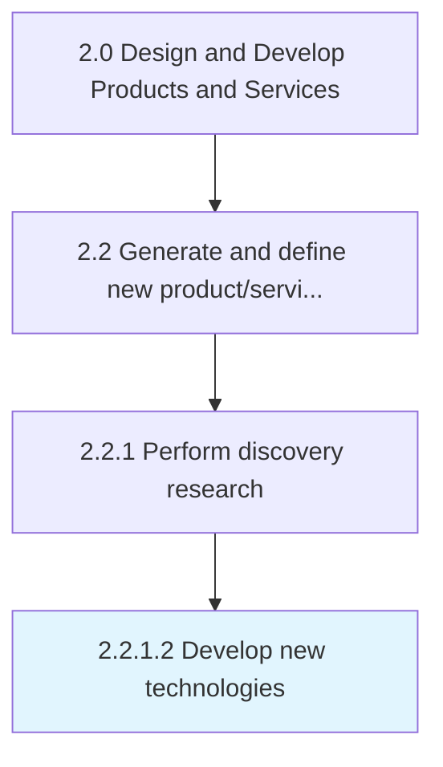
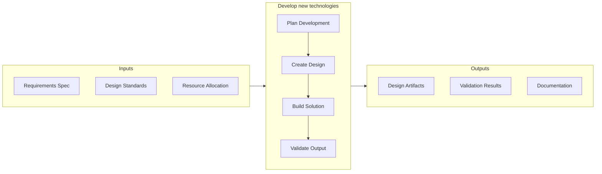

# Develop new technologies

> Developing new technologies from scratch to integrate into a revised portfolio of solutions.

## Overview

Activity 2.2.1.2 is an activity within the Design and Develop Products and Services framework. 

Developing new technologies from scratch to integrate into a revised portfolio of solutions. Develop new technological processes, models, and/or implements in-house, with the objective of improving existing solutions or creating new ones. Consider market realities, as well as the portfolio of products/services. Assess the results in conjunction with senior executives and personnel responsible for the design, processing, and delivery of these solutions. Engage the R&D function, and consider external sources such as offshore providers, specialized research agencies, and crowdsourcing communities.

This activity contributes to the organization's product development objectives by executing defined processes within established quality and timeline parameters. It requires coordination across relevant functional teams and adherence to organizational standards. Outputs from this activity feed into downstream processes and contribute to overall product development success.

## Process Hierarchy



## Key Statistics

| Metric | Value |
|--------|-------|
| APQC Code | 10071 |
| Hierarchy ID | 2.2.1.2 |
| Level | Activity |
| Parent | [2.2.1](../) |
| Sub-Processes | 0 |


## GraphDL Semantic Structure

```graphdl
develop.NewTechnologies
```

| Component | Value | Description |
|-----------|-------|-------------|
| Verb | `develop` | Primary action |
| Object | `new technologies` | Direct object |


## Related Concepts

- NewTechnologies


## Process Flow



## RACI Matrix

| Activity | Responsible | Accountable | Consulted | Informed |
|----------|-------------|-------------|-----------|----------|
| Research and gather inputs | Market Research Analyst | Product Manager | Customer Success | Executive Team |
| Analyze and define requirements | Business Analyst | Product Manager | Engineering Lead | Design Team |
| Review and prioritize | Product Manager | VP of Product | Finance | Development Team |

## Related Occupations

- [Product Manager](/occupations/Management/ProductManagers) - Drives new product/service ideation and definition
- [Market Research Analyst](/occupations/BusinessAndFinancial/MarketResearchAnalysts) - Provides market insights for product concepts
- [UX Designer](/occupations/ArtsAndDesign/IndustrialDesigners) - Translates requirements into user experience designs
- [Business Analyst](/occupations/BusinessAndFinancial/ManagementAnalysts) - Analyzes and documents product requirements

## Related Departments

- Product Management - Leads concept generation and requirements definition
- Research & Development - Conducts discovery research and technology assessment
- [Marketing](/departments/Marketing) - Provides market intelligence and customer insights

## Industry Variations

### Manufacturing

Emphasizes physical product specifications, tooling requirements, and lean production principles in process execution.

### Technology

Focuses on agile development methodologies, continuous integration, and rapid iteration cycles with digital-first delivery.

### Healthcare

Requires adherence to patient safety standards, clinical efficacy validation, and comprehensive regulatory documentation.

## KPIs & Metrics

| Metric | Description | Target |
|--------|-------------|--------|
| Time to Prototype | Duration from concept approval to working prototype | < 30 days |
| Design Iteration Count | Number of design revisions before approval | < 3 iterations |
| Specification Compliance | Percentage of design specs met by prototype | > 95% |

---

*Source: APQC PCF 10071 (2.2.1.2) - APQC*
