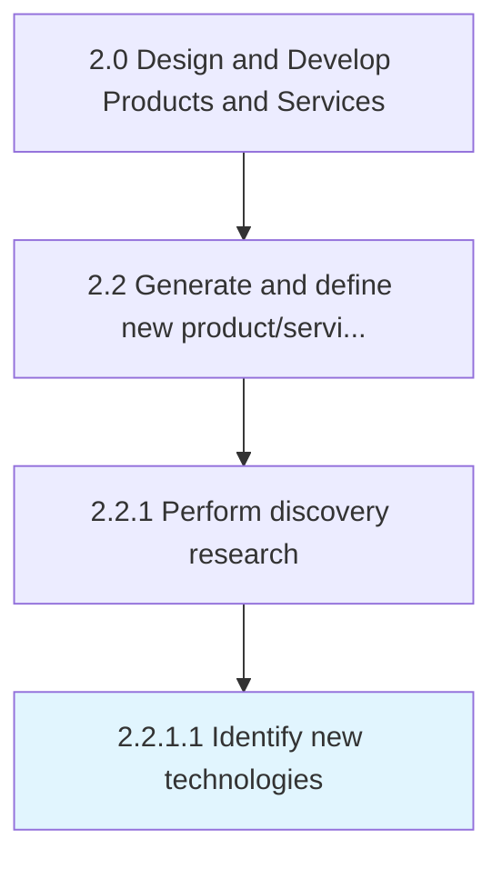

# Identify new technologies

> Determining new technologies to revise the portfolio of solution offerings.

## Overview

Activity 2.2.1.1 is an activity within the Design and Develop Products and Services framework. 

Determining new technologies to revise the portfolio of solution offerings. Identify recently developed technological advances that can be leveraged in the development or advancement of the organization's product/service portfolio. Enlist senior management in conjunction with personnel responsible for the design, processing, and delivery of products/services. Have the organization's research division(s) carry out the process.

## Process Hierarchy



## Key Statistics

| Metric | Value |
|--------|-------|
| APQC Code | 10070 |
| Hierarchy ID | 2.2.1.1 |
| Level | Activity |
| Parent | [2.2.1](../) |
| Sub-Processes | 0 |


## GraphDL Semantic Structure

```
identify.NewTechnologies
```

| Component | Value | Description |
|-----------|-------|-------------|
| Verb | `identify` | Primary action |
| Object | `new technologies` | Direct object |


## Related Concepts

- NewTechnologies


---

*Source: APQC PCF 10070 (2.2.1.1) - APQC*
